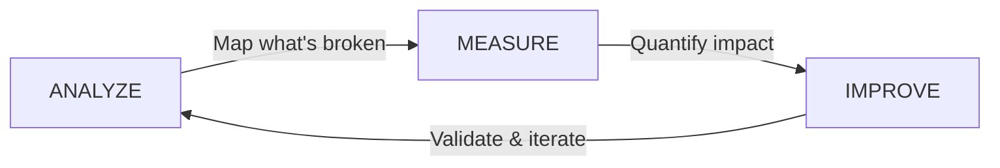

# Agent Evaluation Playbook

This playbook is a practical guide to evaluating AI agents without the ceremony. The goal isn't "more dashboards" — it's **making the agent better in the real world**, on the things your users actually do.

<div class="seatbelt-hero" markdown="0">
<div class="seatbelt-hero__text">
<span class="seatbelt-hero__label">Philosophy</span>
<p class="seatbelt-hero__quote">Agents are sports cars.<br><em>Evals are the seatbelt.</em></p>
<p class="seatbelt-hero__sub">Seatbelts don't steer. They don't tune the engine. They don't make you "better." They just keep you from eating the steering wheel when something goes wrong. If your stance is "we don't need evals because we're careful," you're confusing confidence with safety.</p>
</div>
<div class="seatbelt-hero__text" style="background: linear-gradient(160deg, #162030 0%, #1a2840 100%);">
<span class="seatbelt-hero__label">Mindset</span>
<p class="seatbelt-hero__quote">This is just <em>data science.</em></p>
<p class="seatbelt-hero__sub">Same fundamentals as traditional ML &mdash; dataset, labels, error analysis, iteration. If you're paying $100/seat for an eval tool and still not looking at your data, you're doing it wrong. Expensive tools don't solve the problem &mdash; they just scale whatever process you already have.</p>
</div>
</div>

<div class="rule-grid" markdown="0">
<div class="rule-card">
<span class="rule-card__number">1</span>
<p class="rule-card__title">Evals are adult supervision</p>
<p class="rule-card__desc">Not rocket science. Simple checks that prevent simple disasters. Start here, stay here, expand only when the basics are solid.</p>
</div>
<div class="rule-card">
<span class="rule-card__number">2</span>
<p class="rule-card__title">Define "good" in one sentence</p>
<p class="rule-card__desc">If you can't describe success, no framework will save you. Clarity first, tooling second.</p>
</div>
<div class="rule-card">
<span class="rule-card__number">3</span>
<p class="rule-card__title">Start with pass/fail</p>
<p class="rule-card__desc">Add nuance only after you've earned it. A binary gate catches more failures than a sophisticated rubric you never run.</p>
</div>
<div class="rule-card">
<span class="rule-card__number">4</span>
<p class="rule-card__title">Calibrate your judges</p>
<p class="rule-card__desc">LLM judges are useful. They're also liars with confidence. Calibrate them against humans or don't pretend you measured anything.</p>
</div>
</div>

---

## The Problem with Generic Evaluation

Evaluating AI agents isn't a traditional machine learning task. It's a context-driven problem—requiring more than generic metrics or off-the-shelf tools. Generative agents are unpredictable and can be highly domain-specific, so success demands a tailored approach rooted in:

- **Deep domain expertise**
- **Context-aware error analysis**
- **Metrics tied to real business outcomes**

**There's no silver bullet.** One-size-fits-all evaluation leads to mediocrity. The real question is: *Is this agent improving at the job it was designed to do?*

A customer support agent and an onboarding agent may share similarities, but grading them with the same rubric is like judging a painter and a sculptor by identical standards.

!!! warning "Stop confusing activity with progress"
    Shipping a new dashboard is not the same as shipping reliability.
    If you can't point to **specific failure modes that got better**, you didn't "improve the agent" — you just looked at it differently.

---

## Four Common Mistakes

Before diving into the process, avoid these common pitfalls:

<div class="rule-grid" markdown="0">
<div class="rule-card">
<span class="rule-card__number">1</span>
<p class="rule-card__title">Not Looking at Your Data</p>
<p class="rule-card__desc">The most common and most damaging mistake. Without reviewing raw examples, you're not truly evaluating.</p>
</div>
<div class="rule-card">
<span class="rule-card__number">2</span>
<p class="rule-card__title">Frameworks Before Fundamentals</p>
<p class="rule-card__desc">If your first question is "What framework?", you're starting in the wrong place.</p>
</div>
<div class="rule-card">
<span class="rule-card__number">3</span>
<p class="rule-card__title">Overreliance on Generic Evals</p>
<p class="rule-card__desc">Generic metrics are not a shortcut. If your evals aren't grounded in known errors, you're wasting time.</p>
</div>
<div class="rule-card">
<span class="rule-card__number">4</span>
<p class="rule-card__title">Misusing LLM-as-a-Judge</p>
<p class="rule-card__desc">LLMs can assist evaluation, but relying on them without human validation is a recipe for false confidence.</p>
</div>
</div>

### 1. Not Looking at Your Data

The most common—and most damaging—mistake is neglecting to examine your data. Despite being fundamental, this step is often skipped.

Effective evaluation begins with frictionless, high-quality data exploration and labeling. Without a deep understanding of your agent's failures, any metrics or conclusions you draw are on shaky ground.

**If you haven't spent time reviewing raw examples, you're not truly evaluating.**

!!! info "If this feels "manual," good"
    Start manually. Use spreadsheets. Label failures.
    If you can't do it by hand for 30 examples, you're not ready to automate it for 30,000.

### 2. Frameworks Before Fundamentals

Jumping to tools or frameworks before establishing a process is a red flag.

If your first question is "What framework should I use?", you're starting in the wrong place. Evaluation is not a plug-and-play task. You must define what success looks like for your agent. Frameworks are secondary—they should support your workflow, not define it.

### 3. Overreliance on Generic Evaluations

Generic metrics are not a shortcut—they're a risk.

If your evals aren't grounded in known errors, you're wasting time. Off-the-shelf metrics (e.g., hallucination, toxicity, relevancy) are easy to reach for—but dangerous when misused. Agents are purpose-built. So should your evaluations be.

Generic metrics may be useful *after* understanding your agent's unique failure modes, but using them prematurely becomes a crutch that masks real issues.

### 4. Misusing LLM-as-a-Judge

Large language models can assist in evaluation, but they must be used responsibly.

Relying on LLMs without first validating them against domain expert feedback is a recipe for false confidence. The correct approach:

1. Build a lightweight review pipeline
2. Have experts label a few dozen examples
3. Align your LLM judge to match that standard

**Until you achieve strong agreement between human and model judgment, LLM outputs should be treated as advisory—not definitive.**

!!! warning "Don't confuse "a score" with "truth""
    LLM judges are great at sounding right. That's the problem.
    If you didn't calibrate against humans, you're just grading your homework with the same model class.

---

## The Analyze-Measure-Improve Methodology

The AMI cycle isn't new—it's long been used in traditional ML. But with generative agents, the game has changed. We've moved from predictable single-token outputs to freeform systems with far greater complexity.

If you approach evaluation as a simple side-by-side comparison or a table of results, you'll miss the deeper nuances in your data. True progress requires going beyond surface-level metrics to uncover root causes and meaningful insights.

!!! tip "This is just data science (with a different mindset)"
    The best agent eval workflows look suspiciously like **traditional ML evaluation**, because they are.

    Data scientists have been doing this for years:

    - Curate a representative dataset
    - Label outcomes (often binary)
    - Do error analysis and slice breakdowns
    - Set thresholds, ship changes, measure regressions

    What's "new" with agents is mostly the **mindset shift**:

    - Outputs are messier and more subjective
    - Failures are multi-causal (prompt, retrieval, tools, policy)
    - You need to write down "good" explicitly, or your metrics will quietly drift into vibes



Most AI agent problems aren't solved with a single tweak—they're solved with a disciplined, repeatable process. The AMI lifecycle replaces one-off troubleshooting with a data-driven, continuous improvement loop that:

- Cuts failures
- Speeds time to value
- Manages risk
- Drives measurable gains

### Phase 1: ANALYZE

**Outcome:** A clear map of what's broken and why.

1. Collect representative agent interactions from real-world or test environments
2. Spot and categorize failure patterns (e.g., misunderstood prompts, inconsistent answers)
3. Trace root causes: **Specification Issues** (prompt ambiguity) vs. **Generalization Issues** (context mismatch)

### Phase 2: MEASURE

**Outcome:** Solid baselines and clear priorities grounded in data.

1. Build evaluators targeted at each failure type
2. Quantify how often and how badly issues occur across scenarios
3. Prioritize fixes by business impact, surfaced in dashboards everyone can trust

### Phase 3: IMPROVE

**Outcome:** Fixes that address root causes—not just symptoms.

1. Tighten prompts, definitions, and examples to fix Specification Issues
2. Enrich data and refine model/prompt pipelines for Generalization Issues
3. Roll out changes in controlled environments and validate improvements with metrics

**And do it again, and again, and again.**
Once you can run this loop on purpose, then (and only then) scale it with tooling. Don't stop looking at the data just because you hired a dashboard.

---

## Dataset Best Practices

A strong evaluation starts with the dataset. Your dataset should be grounded in your agent's errors.

### Diversity Matters

- **Comprehensive Testing:** Covers a wide range of situations so the AI is evaluated fairly
- **Realistic Interactions:** Reflects actual user behavior for relevant evaluations
- **Weakness Discovery:** Surfaces areas where the AI struggles or produces errors

### How Many Examples Do You Need?

Start with ~30 examples. Continue adding until no new failure modes appear. Stop when additional examples stop revealing new insights.

!!! tip "Treat your dataset like a crash report backlog"
    Every new failure case is a free bug report. Collect them. Name them. Fix them.
    If you can't describe the failure in plain English, you can't evaluate it.

### Coverage Dimensions

Your golden dataset must be a representative sample of the overall population of queries your end users actually ask:

| Dimension | What to Cover |
|-----------|---------------|
| **Intent Coverage** | All major intents + common "out-of-scope" questions |
| **Utterance Variation** | Formal, casual, slang, misspellings, abbreviations, verbose |
| **Complexity** | Multi-turn dialogues, corrections, partial information |
| **Sentiment & Tone** | Frustrated, urgent, confused, polite interactions |
| **Edge Cases** | Rare but valid queries, known failure modes |

### Dataset Lifecycle

| Phase | Focus |
|-------|-------|
| **Formation** | Curate high-quality real-world utterances with expert validation |
| **Maintenance** | Continuous review cycles with clear governance |
| **Expansion** | Controlled generation and targeted mining of edge cases |

---

## Defining Evaluation Criteria

Binary pass/fail judgments are important, but often not enough. Each judgment must be paired with a **detailed critique**.

### Why Critiques Matter

- **Capture Nuances:** Note if something was mostly correct but had areas for improvement
- **Guide Improvement:** Provide specific insights into how the AI can be enhanced
- **Balance Simplicity with Depth:** Pass/fail offers a clear verdict; critique offers reasoning

### Example: Help Agent Evaluation

| Interaction | Judgment | Critique |
|-------------|----------|----------|
| User asks how to create a custom field. Agent provides accurate step-by-step navigation. | **Pass** | Technically correct and actionable. However, missed opportunities to check permissions first or ask about field type requirements. Met primary need—passes with enhancement opportunities noted. |
| User asks about lead scoring. Agent says "Contact your administrator." | **Fail** | Made assumptions without checking org capabilities. Failed to explore alternatives or explain what lead scoring entails. Dismissive rather than helpful. Due to poor investigation and lack of solutions—fails. |

The critique should be detailed enough to use in a few-shot prompt for an LLM judge.

!!! info "Pass/fail is the seatbelt latch"
    Pass/fail gives you clarity and velocity.
    Critiques tell you what to change so tomorrow's run is better than today's.

---

## Error Classification

Once you know where the errors are, perform an error analysis to identify root causes. The most effective approach is manually classifying examples using a spreadsheet.

### Example Classification

| Root Cause | Count | Percentage |
|------------|-------|------------|
| Insufficient Workflow Guidance | 12 | 40% |
| Ignoring User Context | 8 | 27% |
| Generic Documentation Links | 6 | 20% |
| Missing Permission Checks | 4 | 13% |

Now you know where to focus your efforts. This classification helps identify whether the problem lies in:

- Prompt engineering
- Knowledge retrieval
- Contextual reasoning

---

## Metrics Philosophy

### Metrics Without Actionable Meaning are Worthless

Observability and evaluation are not the same thing. Observability tells you what happened; evaluation is about making agents better—an iterative loop of analyzing, measuring, and improving.

### Why Likert Scales Fail

| Problem | Explanation |
|---------|-------------|
| **Numbers Aren't Actionable** | A "3" doesn't tell you how to improve |
| **Subjectivity** | Evaluators disagree on what qualifies as "minor inaccuracies" vs "some factual errors" |
| **Metrics Rarely Reflect Expert Judgment** | Domain experts make binary calls—approve vs. reject |

### The Better Approach

**Binary outcomes paired with clear critiques** surface what actually matters and provide a direct path for improvement.

**Rule of Thumb:** If you can't clearly explain what a score of 0.8 means—or what action it implies—it's not a useful metric.

---

## Metric Selection Guide

The most common failure mode is "Metric Spaghetti"—throwing every metric at every test case. This burns tokens, increases latency, and creates noise.

!!! tip "Pick the few that matter"
    Start with 2–5 metrics that directly map to real failures.
    If you can't explain why a metric exists in one sentence, delete it.

### Selection by Dimension

#### Retrieval & Context (Did we find the right data?)

| Metric | Type | Use When |
|--------|------|----------|
| `HitRateAtK` | Math | "Did the right doc appear in the top 5?" (Binary) |
| `MeanReciprocalRank` | Math | You care about position |
| `ContextualRelevancy` | LLM | No ground truth ranking—ask "Is this chunk garbage?" |
| `ContextualSufficiency` | LLM | Check if retrieved chunks actually contain the answer |

#### Response Quality (Is the answer correct?)

| Metric | Type | Use When |
|--------|------|----------|
| `FactualAccuracy` | LLM | You have a Golden Answer |
| `Faithfulness` | LLM | RAG essential—checks hallucination |
| `AnswerCompleteness` | LLM | User asked 3 sub-questions—did agent answer all 3? |
| `AnswerCriteria` | LLM | You have business rules to verify |

#### Agent Behavior (Is the interaction working?)

| Metric | Type | Use When |
|--------|------|----------|
| `AnswerRelevancy` | LLM | "Evasion Detector"—penalizes off-topic answers |
| `ConversationEfficiency` | LLM | Penalizes loops (agent asks for same info twice) |
| `GoalCompletion` | LLM | Did user achieve what they came for? |

#### Style & Trust

| Metric | Type | Use When |
|--------|------|----------|
| `ToneStyleConsistency` | LLM | Does it match writing style of reference? |
| `CitationPresence` | Heuristic | Compliance—checks if citations exist |
| `CitationRelevancy` | LLM | Do citations actually support the claim? |

---

## LLM-as-a-Judge Best Practices

### The Anti-Pattern

```
You are an evaluation expert. Judge the correctness based on:
1. Accuracy & Factual Correctness
2. Relevance & Completeness
3. Clarity & Coherence

Give me a score between 1 and 10 and a reason.
```

**Why this fails:**

- What's the difference between a 7 and an 8?
- Five dimensions collapsed into one number
- Score before reasoning (LLMs reason token-by-token)
- No examples to ground the model

### The Better Pattern

**Separation of Concerns:** Split into two steps.

1. **Extraction:** Parse what was said (no judgment yet)
2. **Verification:** Boolean logic—"Does X exist in Y?"

**Atomic Statements:** Break compound sentences into individual facts.

```python
# Instead of scoring "The product has feature A and feature B"
statements = [
    "The product has feature A.",      # Judge: 1 (True)
    "The product has feature B."       # Judge: 0 (False)
]
# Result: 50% accuracy (mathematical, not vibes)
```

**Chain of Thought:** Force analysis before the score.

**Few-Shot Examples:** Always provide examples of good and bad responses with correct scores.

### Judge Model Selection

**The teacher must be smarter than the student.**

You cannot evaluate a GPT-4o agent using a GPT-3.5-Turbo judge. The judge must have reasoning capabilities equal to or greater than the agent being tested.

**Key principle:** "Cheap on generation, expensive on evaluation."

---

## Summary

<div style="background: linear-gradient(135deg, #1E3A5F 0%, #0F2440 100%); padding: 24px; border-radius: 8px; color: white; margin: 20px 0;" markdown="0">
<p style="margin: 0; font-size: 14px; line-height: 1.7;">The goal is not to automate evaluation away &mdash; it's to build resilient, domain-aware evaluation systems that measure what truly matters and drive meaningful, measurable improvement. Start simple. Look at your data. Define "good." Then iterate.</p>
</div>

[Evaluation Flywheel :octicons-arrow-right-24:](evaluation_flywheel.md){ .md-button .md-button--primary }
[Hierarchical Scoring :octicons-arrow-right-24:](guides/hierarchical-scoring.md){ .md-button }
