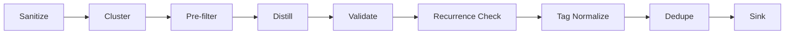

# Pattern Discovery

Pattern Discovery clusters free-text evidence into recurring themes and distills them into actionable **learning artifacts**. It works with any text source — annotation notes, bug reports, user feedback, support tickets — and provides a full pipeline from raw text to validated insights.

## What You'll Learn

<div class="rule-grid" markdown="0">
<div class="rule-card">
<span class="rule-card__number">1</span>
<p class="rule-card__title">Evidence Clustering</p>
<p class="rule-card__desc">Cluster any text into semantic themes using LLM, BERTopic, or hybrid methods.</p>
</div>
<div class="rule-card">
<span class="rule-card__number">2</span>
<p class="rule-card__title">Evidence Pipeline</p>
<p class="rule-card__desc">Full pipeline: sanitize &rarr; cluster &rarr; distill &rarr; validate &rarr; dedupe &rarr; sink.</p>
</div>
<div class="rule-card">
<span class="rule-card__number">3</span>
<p class="rule-card__title">Learning Artifacts</p>
<p class="rule-card__desc">Distill clusters into titled insights with recommended actions and confidence scores.</p>
</div>
<div class="rule-card">
<span class="rule-card__number">4</span>
<p class="rule-card__title">Quality & Safety</p>
<p class="rule-card__desc">Validation gates, PII filtering, recurrence checks, and deduplication strategies.</p>
</div>
</div>

## Quick Start

### Clustering Only

Cluster a list of `EvidenceItem` objects into semantic groups:

```python
from axion.caliber import PatternDiscovery, EvidenceItem, ClusteringMethod

evidence = [
    EvidenceItem(id='bug_1', text='Checkout button unresponsive on mobile Safari'),
    EvidenceItem(id='bug_2', text='Payment form does not submit on iPhone'),
    EvidenceItem(id='bug_3', text='Cart total shows wrong currency symbol'),
    EvidenceItem(id='bug_4', text='Currency formatting broken for EUR prices'),
]

discovery = PatternDiscovery(model_name='gpt-4o-mini', min_category_size=2)
result = await discovery.discover_from_evidence(evidence)

for pattern in result.patterns:
    print(f'[{pattern.category}] ({pattern.count} items): {pattern.record_ids}')
```

### Full Pipeline

Run the complete pipeline — clustering, distillation into learning artifacts, validation, and persistence:

```python
from axion.caliber import EvidencePipeline, InMemorySink, MetadataConfig

sink = InMemorySink()

pipeline = EvidencePipeline(
    model_name='gpt-4o-mini',
    recurrence_threshold=2,
    min_category_size=2,
    domain_context='E-commerce platform bug triage',
    sink=sink,
)

result = await pipeline.run(evidence)

for learning in result.learnings:
    print(f'{learning.title} (confidence={learning.confidence})')
    for action in learning.recommended_actions:
        print(f'  - {action}')
```

## Core Concepts

### EvidenceItem

The universal input type. Any text source with an ID, the text itself, optional metadata, and an optional source reference for provenance tracking:

```python
EvidenceItem(
    id='ticket_42',
    text='Search returns no results for valid product names',
    metadata={'severity': 'high', 'platform': 'web'},
    source_ref='jira_PROJ-42',  # for recurrence checking
)
```

### Clustering Methods

| Method | How it works | Best for |
|--------|-------------|----------|
| `ClusteringMethod.LLM` | LLM reads all evidence and outputs semantic clusters | Small-medium datasets, best label quality |
| `ClusteringMethod.BERTOPIC` | BERTopic statistical topic modeling, no LLM calls | Large datasets, cost-sensitive, 5+ documents |
| `ClusteringMethod.HYBRID` | BERTopic clustering + LLM label refinement | Large datasets where you want readable labels |

```python
# LLM-only (default)
result = await discovery.discover_from_evidence(evidence, method=ClusteringMethod.LLM)

# BERTopic (no LLM cost)
result = await discovery.discover_from_evidence(evidence, method=ClusteringMethod.BERTOPIC)

# Hybrid: BERTopic clusters + LLM-refined labels
result = await discovery.discover_from_evidence(evidence, method=ClusteringMethod.HYBRID)
```

### Learning Artifacts

The pipeline distills each cluster into a `LearningArtifact` — a structured insight ready for consumption:

```python
LearningArtifact(
    title='Mobile Checkout Failures on iOS',
    content='Multiple reports of checkout and payment flows...',
    tags=['ios', 'checkout', 'mobile'],
    confidence=0.9,
    supporting_item_ids=['bug_1', 'bug_2', 'feedback_1'],
    recommended_actions=[
        'Investigate touch event handling in mobile Safari',
        'Add fallback submit mechanism for iOS WebKit',
    ],
    counterexamples=['bug_3'],       # IDs that look similar but differ
    scope='iOS mobile checkout flow',
    when_not_to_apply='Desktop browsers or Android devices',
)
```

## Evidence Pipeline

The `EvidencePipeline` orchestrates the full workflow:



### Pipeline Stages

| Stage | What it does | Configurable via |
|-------|-------------|-----------------|
| **Sanitize** | Optional async text cleaning | `sanitizer=` (implements `Sanitizer` protocol) |
| **Cluster** | Groups evidence into themes | `method=`, `clusterer=` (implements `EvidenceClusterer`) |
| **Pre-filter** | Drops clusters below `recurrence_threshold` | `recurrence_threshold=` |
| **Distill** | LLM converts each cluster into a learning artifact | `domain_context=`, `max_concurrent_distillations=` |
| **Validate** | Repairs hallucinated IDs, enforces quality gates | Automatic |
| **Recurrence** | Ensures learnings span multiple unique sources | `recurrence_threshold=` |
| **Tag normalize** | Lowercase, deduplicate, cap at 10 tags | Automatic |
| **Dedupe** | Removes near-duplicate learnings | `deduper=` (implements `Deduper`) |
| **Sink** | Persists artifacts with provenance metadata | `sink=` (implements `ArtifactSink`) |

### Configuration

```python
pipeline = EvidencePipeline(
    # LLM settings
    model_name='gpt-4o-mini',
    llm_provider='openai',

    # Clustering
    method=ClusteringMethod.LLM,
    min_category_size=2,
    max_notes=200,

    # Distillation
    domain_context='Customer support ticket analysis',
    max_concurrent_distillations=5,

    # Quality gates
    recurrence_threshold=2,  # need 2+ unique sources per learning

    # Metadata
    metadata_config=MetadataConfig(
        include_in_clustering=True,
        include_in_distillation=True,
        allowed_keys={'severity', 'platform', 'category'},
    ),

    # Plugins
    sink=InMemorySink(),
    deduper=InMemoryDeduper(),
)
```

### Pipeline Result

```python
result = await pipeline.run(evidence)

result.clustering_result   # PatternDiscoveryResult — the raw clusters
result.learnings           # list[LearningArtifact] — distilled insights
result.filtered_count      # clusters dropped by pre-filter
result.deduplicated_count  # learnings removed by deduper
result.validation_repairs  # count of hallucinated-ID repairs
result.sink_ids            # IDs returned by the sink after persistence
```

## Metadata Handling

### MetadataConfig

Control how metadata flows through the pipeline:

```python
from axion.caliber import MetadataConfig

config = MetadataConfig(
    include_in_clustering=True,      # attach metadata to clustering prompts
    include_in_distillation=True,    # attach metadata to distillation prompts
    allowed_keys={'severity', 'platform'},  # only these keys pass through
    denied_keys=set(),               # explicit denylist (PII defaults apply)
)
```

### PII Safety

By default, metadata keys matching common PII patterns are excluded:

> `email`, `phone`, `name`, `address`, `ssn`, `password`, `token`, `credit_card`

These are filtered before any data reaches an LLM. You can customize the denylist via `MetadataConfig.denied_keys`.

### Metadata in Clusters

When `include_in_clustering=True`, each evidence note sent to the LLM includes a compact header:

```
[meta: severity=high, platform=ios] Checkout button unresponsive on mobile Safari
```

During distillation, cluster-level metadata is aggregated into frequency distributions so the LLM sees patterns like "severity: high (3), medium (1)".

## Plugins

### Sinks (Output Storage)

=== ":material-memory: InMemorySink"

    Dict-based storage, ideal for testing and notebooks:

    ```python
    from axion.caliber import InMemorySink

    sink = InMemorySink()
    result = await pipeline.run(evidence)

    for sid, entry in sink.artifacts.items():
        print(entry['artifact'].title, entry['provenance'].timestamp)
    ```

=== ":material-file-document: JsonlSink"

    Appends each artifact as a JSON line to a file:

    ```python
    from axion.caliber import JsonlSink

    sink = JsonlSink(path='learnings.jsonl')
    result = await pipeline.run(evidence)
    # Each learning is appended as one JSON line
    ```

=== ":material-puzzle: Custom Sink"

    Implement the `ArtifactSink` protocol:

    ```python
    from axion.caliber import ArtifactSink, LearningArtifact, Provenance

    class DatabaseSink:
        async def write(
            self,
            artifact: LearningArtifact,
            provenance: Provenance,
        ) -> str:
            # persist to your database
            return record_id
    ```

### Dedupers

=== ":material-text-search: InMemoryDeduper"

    Case-insensitive title matching — lightweight, no external dependencies:

    ```python
    from axion.caliber import InMemoryDeduper

    deduper = InMemoryDeduper()
    ```

=== ":material-vector-triangle: EmbeddingDeduper"

    Cosine similarity on OpenAI embeddings (threshold defaults to 0.85):

    ```python
    from axion.caliber import EmbeddingDeduper

    deduper = EmbeddingDeduper(threshold=0.85)  # requires axion[embeddings]
    ```

## Validation & Quality Gates

The pipeline automatically validates every learning artifact:

### Hallucinated ID Repair

If the LLM references item IDs that don't exist in the cluster, they are silently removed. If **all** IDs are invalid, the learning is dropped entirely.

### Confidence Demotion

Learnings with `confidence >= 0.7` but **no recommended actions** are demoted to `confidence = 0.69` — the reasoning being that a high-confidence insight should be actionable.

### Recurrence Checking

A learning must be backed by evidence from multiple unique sources (controlled by `recurrence_threshold`). Two chunks from the same conversation count as one source — the check uses `source_ref` to deduplicate.

```python
# Standalone usage
from axion.caliber.pattern_discovery._utils import validate_learning

repaired, repair_count = validate_learning(raw_learning, cluster_item_ids)
```

## Legacy API

The original `discover()` method still works for annotation-based workflows:

```python
from axion.caliber import PatternDiscovery, AnnotatedItem

annotations = {
    'rec_1': AnnotatedItem(record_id='rec_1', score=0, notes='Missing context'),
    'rec_2': AnnotatedItem(record_id='rec_2', score=0, notes='Too verbose'),
}

discovery = PatternDiscovery(model_name='gpt-4o-mini')
result = await discovery.discover(annotations, method=ClusteringMethod.LLM)
```

This is equivalent to converting annotations to `EvidenceItem` objects and calling `discover_from_evidence()`. The conversion happens automatically via the compatibility layer.

## Using with Evaluation Issues

The `InsightExtractor` bridges evaluation issues with this pipeline. It converts `ExtractedIssue` objects (from the [Issue Extractor](../../guides/issue-extraction.md)) into `EvidenceItem` objects and runs them through `EvidencePipeline` to discover cross-metric patterns:

```python
from axion.reporting import IssueExtractor, InsightExtractor

issues = IssueExtractor().extract_from_evaluation(results)
insights = await InsightExtractor(model_name='gpt-4o-mini').analyze(issues)

for pattern in insights.patterns:
    if pattern.is_cross_metric:
        print(f"{pattern.category}: {', '.join(pattern.metrics_involved)}")
```

See the [Cross-Metric Insight Extraction Guide](../../guides/insight-extraction.md) for full details.

## API Summary

| API | Input | Output | Use when |
|-----|-------|--------|----------|
| `PatternDiscovery.discover()` | `Dict[str, AnnotatedItem]` | `PatternDiscoveryResult` | You have annotation notes from human evaluators |
| `PatternDiscovery.discover_from_evidence()` | `Sequence[EvidenceItem]` or `Dict` | `PatternDiscoveryResult` | Clustering only, from any text source |
| `EvidencePipeline.run()` | `Sequence[EvidenceItem]` or `Dict` | `PipelineResult` | Full pipeline: cluster + distill + validate + dedupe + sink |
| `InsightExtractor.analyze()` | `IssueExtractionResult` | `InsightResult` | Cross-metric pattern discovery from evaluation issues |

---

<div class="ref-nav" markdown="1">

[Caliber API Reference :octicons-arrow-right-24:](../../reference/caliber.md){ .md-button .md-button--primary }
[CaliberHQ Guide :octicons-arrow-right-24:](../../guides/caliberhq.md){ .md-button }
[Example Selector :octicons-arrow-right-24:](example-selector.md){ .md-button }

</div>
