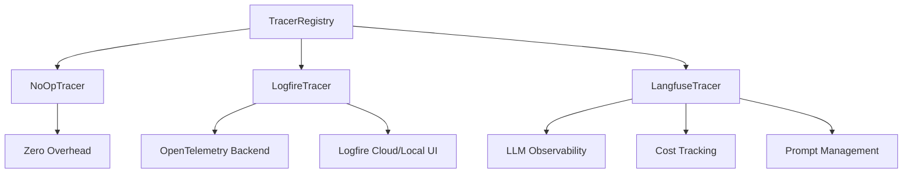

# Axion Tracing System

Simple observability for AI applications with automatic context management. Supports multiple backends including Logfire (OpenTelemetry) and Langfuse for LLM-specific observability.

## Why Use Axion Tracing?

- **Zero setup** - Configure once, trace everywhere
- **Automatic context** - No manual tracer passing between functions
- **AI-optimized** - Built-in support for LLM, evaluation, and knowledge operations
- **Production ready** - NOOP mode for zero overhead when tracing is disabled
- **Extensible** - Registry pattern makes it easy to add custom tracer providers
- **Multiple backends** - Choose between Logfire, Langfuse, or create your own

## Quick Start

```python
from axion.tracing import init_tracer, trace

class MyService:
    def __init__(self):
        self.tracer = init_tracer('llm')

    @trace(name='internal_span', capture_result=True)
    async def process(self, data: dict):
        return 100

    @trace(name='span', capture_result=True)
    async def run(self):
        # Set manual span for tracing
        async with self.tracer.async_span("manual_span") as span:
            # set attribute on span
            span.set_attribute("output_status", "success")
            return await self.process({"key": "value"})

await MyService().run()
```

---

## Tracing Providers

Axion supports three built-in tracing providers, all managed through a unified registry system:

| Provider | Description | Use Case |
|----------|-------------|----------|
| `noop` | No-operation tracer with zero overhead | Testing, production without tracing |
| `logfire` | OpenTelemetry-based tracing via Logfire | General observability, performance monitoring |
| `langfuse` | LLM-specific observability platform | LLM cost tracking, prompt management, evaluations |

### Provider Comparison



---

## Configuration

Configuration is managed by a single environment variable that selects which tracing provider to use.

### Environment Variable

Set `TRACING_MODE` to one of the following values:

| tracing_mode | Provider | Description | Additional Env Vars Needed |
|--------------|----------|-------------|----------------------------|
| `noop` | NoOpTracer | Disables all tracing. Methods are available but do nothing. | None |
| `logfire_local` | LogfireTracer | Local development with `logfire dev` command. | None |
| `logfire_hosted` | LogfireTracer | Sends traces to Logfire cloud service. | `LOGFIRE_TOKEN` |
| `logfire_otel` | LogfireTracer | Sends traces to custom OpenTelemetry endpoint. | `OTEL_ENDPOINT` |
| `langfuse` | LangfuseTracer | LLM observability via Langfuse. | `LANGFUSE_PUBLIC_KEY`, `LANGFUSE_SECRET_KEY` |

### Logfire Configuration

```bash
# For local development with Logfire UI
TRACING_MODE=logfire_local

# For Logfire cloud
TRACING_MODE=logfire_hosted
LOGFIRE_TOKEN=your-logfire-token
LOGFIRE_PROJECT=your-project-name  # Optional

# For custom OpenTelemetry endpoint
TRACING_MODE=logfire_otel
OTEL_EXPORTER_OTLP_TRACES_ENDPOINT=https://your-otel-endpoint
```

### Langfuse Configuration

```bash
TRACING_MODE=langfuse
LANGFUSE_PUBLIC_KEY=pk-lf-your-public-key
LANGFUSE_SECRET_KEY=sk-lf-your-secret-key
LANGFUSE_BASE_URL=https://cloud.langfuse.com  # EU region (default)
# or https://us.cloud.langfuse.com for US region
```

### Programmatic Configuration

You can override the global setting by passing an argument to `configure_tracing`.

```python
from axion.tracing import configure_tracing, TracingMode

# Configure based on the Pydantic settings object (standard way)
configure_tracing()

# Use force=True to override any previously set configuration,
# which is especially useful in testing environments.
configure_tracing(tracing_mode=TracingMode.NOOP, force=True)

# Configure for Langfuse
configure_tracing(tracing_mode=TracingMode.LANGFUSE)
```

---

## TracerRegistry Architecture

The tracing system uses a decorator-based registry pattern, similar to `LLMRegistry`. This makes it easy to:

- Switch between providers at runtime
- Add custom tracer implementations
- Extend functionality without modifying core code

### How It Works

```python
from axion.tracing import TracerRegistry, BaseTracer

# List all registered providers
providers = TracerRegistry.list_providers()
print(providers)  # ['noop', 'logfire', 'langfuse']

# Get a specific tracer class
TracerClass = TracerRegistry.get('langfuse')
tracer = TracerClass.create(metadata_type='llm')
```

### Creating Custom Tracers

You can create custom tracer implementations by subclassing `BaseTracer` and registering with the `@TracerRegistry.register()` decorator:

```python
from axion.tracing import TracerRegistry, BaseTracer
from contextlib import contextmanager, asynccontextmanager

@TracerRegistry.register('my_custom_tracer')
class MyCustomTracer(BaseTracer):
    """Custom tracer implementation."""

    def __init__(self, metadata_type: str = 'default', **kwargs):
        self.metadata_type = metadata_type
        # Initialize your tracing backend here

    @classmethod
    def create(cls, metadata_type: str = 'default', **kwargs):
        return cls(metadata_type=metadata_type, **kwargs)

    @contextmanager
    def span(self, operation_name: str, **attributes):
        # Implement span creation
        print(f"Starting span: {operation_name}")
        try:
            yield self
        finally:
            print(f"Ending span: {operation_name}")

    @asynccontextmanager
    async def async_span(self, operation_name: str, **attributes):
        # Implement async span creation
        print(f"Starting async span: {operation_name}")
        try:
            yield self
        finally:
            print(f"Ending async span: {operation_name}")

    def start(self, **attributes):
        pass

    def complete(self, output_data=None, **attributes):
        pass

    def fail(self, error: str, **attributes):
        pass

    def add_trace(self, event_type: str, message: str, metadata=None):
        pass

# Now you can use it
configure_tracing(tracing_mode='my_custom_tracer')
```

---

## Usage Patterns

### Decorator Tracing (Recommended)

The tracer attribute is required for `@trace` decorator.
The `@trace` decorator automatically looks for a tracer attribute on the class instance (`self`) to create and manage spans.

```python
from axion.tracing import init_tracer, trace

class DecoratorService:
    def __init__(self):
        self.tracer = init_tracer('base')

    @trace(name="process_data", capture_args=True, capture_result=True)
    async def process(self, data: dict):
        await asyncio.sleep(0.1)
        return {"status": "processed", "items": len(data)}

    @trace  # Simple usage without arguments
    async def run(self):
        result = await self.process({"id": 123, "items": ["a", "b"]})
        return result

# Usage
service = DecoratorService()
await service.run()
```

### Context-Aware Function Tracing

Use `init_tracer` at the top level of a service or class to start a new trace context. Use `get_current_tracer` in downstream functions or services that you expect to be called within an existing trace, allowing them to add child spans without needing the tracer to be passed in manually.

```python
from axion.tracing import get_current_tracer, init_tracer

class ServiceA:
    def __init__(self):
        self.tracer = init_tracer('llm')

    async def process(self):
        async with self.tracer.async_span("service_a_process"):
            # Context automatically propagates to ServiceB
            service_b = ServiceB()
            await service_b.process()

class ServiceB:
    async def process(self):
        # Get tracer from context - no manual passing needed!
        tracer = get_current_tracer()
        async with tracer.async_span("service_b_process"):
            return "processed"

# Usage
service = ServiceA()
await service.process()
```

### Langfuse-Specific Features

When using Langfuse, you get additional LLM-specific features:

```python
import os
os.environ['TRACING_MODE'] = 'langfuse'
os.environ['LANGFUSE_PUBLIC_KEY'] = 'pk-lf-...'
os.environ['LANGFUSE_SECRET_KEY'] = 'sk-lf-...'

from axion.tracing import configure_tracing, Tracer

configure_tracing()
tracer = Tracer('llm')

# Create spans that appear in Langfuse
with tracer.span('my-operation') as span:
    # Your code here
    span.set_attribute('custom_key', 'custom_value')

# Log LLM calls with token usage
tracer.log_llm_call(
    name='chat_completion',
    model='gpt-4',
    prompt='Hello, how are you?',
    response='I am doing well, thank you!',
    usage={
        'prompt_tokens': 10,
        'completion_tokens': 8,
        'total_tokens': 18
    }
)

# Log evaluations as scores
tracer.log_evaluation(
    name='relevance_score',
    score=0.95,
    comment='Highly relevant response'
)

# Important: Flush traces before exiting
tracer.flush()
```

### Input/Output Capture

Spans support `set_input()` and `set_output()` methods for capturing data that appears in the Langfuse UI's Input and Output fields:

```python
async with tracer.async_span('my-operation') as span:
    # Capture the input data
    span.set_input({
        'query': 'What is Data Cloud?',
        'context': ['doc1', 'doc2'],
    })

    result = await process_query(query)

    # Capture the output data
    span.set_output({
        'response': result.text,
        'score': result.confidence,
    })
```

The `@trace` decorator automatically captures input/output when enabled:

```python
@trace(name="process_data", capture_args=True, capture_result=True)
async def process(self, data: dict):
    # Input (args/kwargs) automatically captured via span.set_input()
    result = await do_work(data)
    # Result automatically captured via span.set_output()
    return result
```

**Supported data types for serialization:**
- Pydantic models (serialized via `model_dump()`)
- Dictionaries, lists, and primitive types
- Other objects are converted to string representation

### Custom Span Names

Axion components use meaningful span names for better observability:

**Evaluation Runner**: Uses `evaluation_name` as the trace name in Langfuse:
```python
results = evaluation_runner(
    evaluation_inputs=dataset,
    scoring_metrics=[AnswerRelevancy()],
    evaluation_name="My RAG Evaluation"  # This becomes the trace name
)
# Appears as "My RAG Evaluation" in Langfuse instead of "evaluation_runner"
```

**LLM Handlers**: Use `metadata.name` or class name as the span name:
```python
class SentimentAnalysisHandler(LLMHandler):
    # ... handler config ...
    pass

handler = SentimentAnalysisHandler()
# Appears as "SentimentAnalysisHandler" in Langfuse instead of "llm_handler"

# Or set a custom name via metadata
handler.metadata.name = "Sentiment Analysis"
# Now appears as "Sentiment Analysis" in Langfuse
```

### Complete Example

```python
import asyncio
from axion.tracing import init_tracer, trace
from axion.metrics import AnswerRelevancy
from axion.dataset import DatasetItem
from axion._core.metadata.schema import ToolMetadata

class MetricService:
    def __init__(self):
        # Set Context on Span
        tool_metadata = ToolMetadata(
            name="MetricService",
            description='My Service',
            version='1.0.1',
        )
        self.tracer = init_tracer(
            metadata_type='llm',
            tool_metadata=tool_metadata,
        )

    @trace(capture_result=True)
    async def run_metric(self):
        # AnswerRelevancy has its own tracer and auto-captured as a child span
        metric = AnswerRelevancy()
        data_item = DatasetItem(
            query="What is Data Cloud?",
            actual_output="Data Cloud is a hyperscale data platform to unlock value built on the Salesforce Platform.",
            expected_output="Data Cloud is a hyperscale data platform built directly into Salesforce.",
        )
        return await metric.execute(data_item)

    @trace(name="doing_work")
    async def do_some_work(self):
        await asyncio.sleep(0.5)
        return "Work done!"

    @trace(name='run_main_task')
    async def run_main_task(self):
        # Can also set manual spans
        async with self.tracer.async_span("metric_evaluation") as span:
            _ = await self.do_some_work()
            result = await self.run_metric()
            span.set_attribute("operation_status", "success")
        return result

# Usage
service = MetricService()
result = await service.run_main_task()
```

---

## Metadata Types

Choose the right type for automatic specialized handling:

- **`'base'`** - General operations
- **`'llm'`** - Language model calls (captures tokens, model info)
- **`'knowledge'`** - Search and retrieval (captures queries, results)
- **`'database'`** - Database operations (captures performance)
- **`'evaluation'`** - Evaluation metrics (captures scores)

---

## API Reference

### Core Functions

| Function | Description |
|----------|-------------|
| `configure_tracing(tracing_mode, force)` | Configure the global tracing system |
| `get_tracer()` | Get the configured tracer class |
| `init_tracer(metadata_type, tool_metadata)` | Initialize a tracer instance |
| `Tracer(metadata_type)` | Factory function for tracer instances |
| `reset_tracing()` | Reset configuration (useful for testing) |

### Context Management

| Function | Description |
|----------|-------------|
| `get_current_tracer()` | Get active tracer from context |
| `set_current_tracer(tracer)` | Set tracer in context |
| `reset_tracer_context(token)` | Reset tracer context |

### Span Methods

| Method | Description |
|--------|-------------|
| `span.set_attribute(key, value)` | Set a single attribute on the span |
| `span.set_attributes(dict)` | Set multiple attributes at once |
| `span.set_input(data)` | Set input data (appears in Langfuse Input field) |
| `span.set_output(data)` | Set output data (appears in Langfuse Output field) |
| `span.add_trace(event_type, message, metadata)` | Add a trace event to the span |

### Registry

| Function | Description |
|----------|-------------|
| `TracerRegistry.register(name)` | Decorator to register a tracer class |
| `TracerRegistry.get(name)` | Get a tracer class by name |
| `TracerRegistry.list_providers()` | List all registered providers |
| `TracerRegistry.is_registered(name)` | Check if a provider is registered |

### Decorator Options

| Option | Description |
|--------|-------------|
| `name` | Custom span name (defaults to function name) |
| `capture_args` | Capture function arguments as span input |
| `capture_result` | Capture function result as span output |

### Types

| Type | Description |
|------|-------------|
| `TracingMode` | Enumeration of available tracer modes |
| `TracerRegistry` | Registry for tracer implementations |
| `BaseTracer` | Abstract base class for tracer implementations |

---

## Integration

The tracing system automatically works with other Axion components:

- **Evaluation metrics** are automatically traced
- **API calls** include retry and performance data
- **LLM operations** capture token usage and model info

Just initialize your tracer and everything else traces automatically.

---

## Installation

The tracing providers are optional dependencies:

```bash
# Install with Logfire support
pip install axion[logfire]

# Install with Langfuse support
pip install axion[langfuse]

# Install with all tracing providers
pip install axion[tracing]
```
