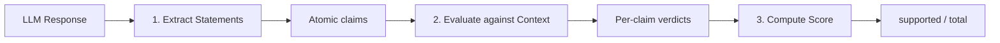

# Building Composite Evaluation Metrics

Composite metrics chain multiple LLM calls together to evaluate complex properties that no single prompt can capture well. Each sub-metric handles one focused task, and an orchestrator combines their outputs into a final score.

This pattern is how Axion implements metrics like **Faithfulness**, **AnswerRelevancy**, and **FactualAccuracy** internally. Below, we re-create the [Faithfulness metric](https://docs.ragas.io/en/stable/concepts/metrics/available_metrics/faithfulness/?h=faith) from scratch to show the technique.

## Faithfulness Metric

The Faithfulness metric evaluates how factually consistent a response is with the retrieved context. It is scored between 0 and 1, where higher values indicate greater consistency. A response is considered faithful if every claim it makes is fully supported by the retrieved context.

### How It Works



| Step | Sub-metric | Input | Output |
|------|-----------|-------|--------|
| **1. Extract** | `StatementGenerator` | Question + Answer | List of atomic statements |
| **2. Evaluate** | `NLIStatement` | Statements + Context | Per-statement verdict (0 or 1) |
| **3. Score** | `Faithfulness` | Verdicts | `supported_count / total_count` |

## Step 1: Statement Generator

The first sub-metric breaks an answer into atomic, self-contained claims. Each statement should be understandable on its own without pronouns or ambiguous references.

```python title="Statement Generator"
from pydantic import Field
from typing import List

from axion.metrics.base import BaseMetric
from axion.schema import RichBaseModel


class StatementGeneratorInput(RichBaseModel):
    question: str = Field(description='The question to answer')
    answer: str = Field(description='The answer to the question')


class StatementGeneratorOutput(RichBaseModel):
    statements: List[str] = Field(description='The generated statements')


class StatementGenerator(BaseMetric[StatementGeneratorInput, StatementGeneratorOutput]):
    instruction = "Given a question, an answer, and sentences from the answer analyze the complexity of each sentence given under 'sentences' and break down each sentence into one or more fully understandable statements while also ensuring no pronouns are used in each statement."
    input_model = StatementGeneratorInput
    output_model = StatementGeneratorOutput
    description = 'Statement Generator Prompt'
    examples = [
        (
            StatementGeneratorInput(
                question='Who was Albert Einstein and what is he best known for?',
                answer='He was a German-born theoretical physicist, widely acknowledged to be one of the greatest and most influential physicists of all time. He was best known for developing the theory of relativity, he also made important contributions to the development of the theory of quantum mechanics.',
            ),
            StatementGeneratorOutput(
                statements=[
                    'Albert Einstein was a German-born theoretical physicist.',
                    'Albert Einstein is recognized as one of the greatest and most influential physicists of all time.',
                    'Albert Einstein was best known for developing the theory of relativity.',
                    'Albert Einstein also made important contributions to the development of the theory of quantum mechanics.',
                ]
            ),
        )
    ]
```

The `instruction` and `examples` are all you need — `BaseMetric` handles the LLM call and response parsing automatically.

## Step 2: NLI Statement Evaluator

The second sub-metric judges each statement against the retrieved context using Natural Language Inference (NLI). Each statement gets a binary verdict: `1` if supported, `0` if not.

```python title="NLI Statement Evaluator"
class StatementFaithfulnessAnswer(RichBaseModel):
    statement: str = Field(..., description='the original statement, word-by-word')
    reason: str = Field(..., description='the reason of the verdict')
    verdict: int = Field(..., description='the verdict(0/1) of the faithfulness.')


class NLIStatementInput(RichBaseModel):
    retrieved_content: str = Field(
        ..., description='The retrieved content from the model'
    )
    statements: List[str] = Field(..., description='The statements to judge')


class NLIStatementOutput(RichBaseModel):
    statements: List[StatementFaithfulnessAnswer]


class NLIStatement(BaseMetric[NLIStatementInput, NLIStatementOutput]):
    instruction = 'Your task is to judge the faithfulness of a series of statements based on a given context. For each statement you must return verdict as 1 if the statement can be directly inferred based on the context or 0 if the statement can not be directly inferred based on the context.'
    input_model = NLIStatementInput
    output_model = NLIStatementOutput
    description = 'NLI Statement Prompt'
    examples = [
        (
            NLIStatementInput(
                retrieved_content="""John is a student at XYZ University. He is pursuing a degree in Computer Science. He is enrolled in several courses this semester, including Data Structures, Algorithms, and Database Management. John is a diligent student and spends a significant amount of time studying and completing assignments. He often stays late in the library to work on his projects.""",
                statements=[
                    'John is majoring in Biology.',
                    'John is taking a course on Artificial Intelligence.',
                    'John is a dedicated student.',
                    'John has a part-time job.',
                ],
            ),
            NLIStatementOutput(
                statements=[
                    StatementFaithfulnessAnswer(
                        statement='John is majoring in Biology.',
                        reason="John's major is explicitly mentioned as Computer Science. There is no information suggesting he is majoring in Biology.",
                        verdict=0,
                    ),
                    StatementFaithfulnessAnswer(
                        statement='John is taking a course on Artificial Intelligence.',
                        reason='The context mentions the courses John is currently enrolled in, and Artificial Intelligence is not mentioned. Therefore, it cannot be deduced that John is taking a course on AI.',
                        verdict=0,
                    ),
                    StatementFaithfulnessAnswer(
                        statement='John is a dedicated student.',
                        reason='The context states that he spends a significant amount of time studying and completing assignments. Additionally, it mentions that he often stays late in the library to work on his projects, which implies dedication.',
                        verdict=1,
                    ),
                    StatementFaithfulnessAnswer(
                        statement='John has a part-time job.',
                        reason='There is no information given in the context about John having a part-time job.',
                        verdict=0,
                    ),
                ]
            ),
        ),
        (
            NLIStatementInput(
                retrieved_content='Photosynthesis is a process used by plants, algae, and certain bacteria to convert light energy into chemical energy.',
                statements=[
                    'Albert Einstein was a genius.',
                ],
            ),
            NLIStatementOutput(
                statements=[
                    StatementFaithfulnessAnswer(
                        statement='Albert Einstein was a genius.',
                        reason='The context and statement are unrelated',
                        verdict=0,
                    )
                ]
            ),
        ),
    ]
```

Few-shot examples are critical here — they calibrate the LLM to apply consistent judgment criteria across different contexts.

## Step 3: Faithfulness Orchestrator

The main `Faithfulness` class composes the two sub-metrics and adds the scoring logic. It doesn't define its own `instruction` — instead, it overrides `execute()` to orchestrate the pipeline.

```python title="Faithfulness Orchestrator"
from typing import Union, Any
import numpy as np

from axion.metrics.base import MetricEvaluationResult
from axion.dataset import DatasetItem
from axion._core.logging import get_logger

logger = get_logger(__name__)


class Faithfulness(BaseMetric):
    """
    Computes faithfulness scores for LLM-generated responses based on retrieved contexts.

    This metric works by:
    1. Breaking down the LLM response into atomic statements
    2. Evaluating each statement against the retrieved context
    3. Computing a faithfulness score as the ratio of supported statements
    """

    def __init__(self, **kwargs):
        super().__init__(**kwargs)
        self.statement_generator = StatementGenerator(**kwargs)
        self.nli_evaluator = NLIStatement(**kwargs)

    async def _create_statements(self, query: str, output: str) -> List[str]:
        result = await self.statement_generator.execute(
            StatementGeneratorInput(question=query, answer=output)
        )
        if not result.statements:
            logger.warning('No statements were generated from the answer.')
        return result.statements

    async def _evaluate_statements(
        self, retrieved_content: str, statements: List[str]
    ) -> NLIStatementOutput:
        if not statements:
            logger.warning('No statements provided for evaluation.')
            return NLIStatementOutput(statements=[])
        formatted_content = self.convert_retrieved_content_to_string(retrieved_content)
        return await self.nli_evaluator.execute(
            NLIStatementInput(
                retrieved_content=formatted_content, statements=statements
            )
        )

    @staticmethod
    def convert_retrieved_content_to_string(
        retrieved_content: Union[str, List[str]], separator: str = '\n'
    ) -> str:
        if isinstance(retrieved_content, list):
            retrieved_content = separator.join(retrieved_content)
        return retrieved_content

    @staticmethod
    def _compute_score(evaluation_results: NLIStatementOutput) -> float:
        statements = evaluation_results.statements
        if not statements:
            logger.warning('No statements were evaluated.')
            return np.nan

        faithful_count = sum(1 for statement in statements if statement.verdict)
        return faithful_count / len(statements)

    async def execute(self, item: DatasetItem) -> MetricEvaluationResult:
        statements = await self._create_statements(item.query, item.actual_output)
        if not statements:
            return MetricEvaluationResult(
                score=np.nan,
            )

        evaluation_results = await self._evaluate_statements(
            item.retrieved_content, statements
        )
        score = self._compute_score(evaluation_results)

        return MetricEvaluationResult(score=score)
```

## Running the Metric

```python
metric = Faithfulness()

data_item = DatasetItem(
    query = "How do I reset my password?",
    actual_output = "To reset your password, click 'Forgot Password' on the login page and follow the email instructions.",
    expected_output = "Navigate to login, click 'Forgot Password', and follow the reset link sent to your email.",
    retrieved_content = ["Password reset available via login page", "Reset link sent by email"],
    latency = 2.13
)
result = await metric.execute(data_item)
print(result.pretty())
```

---

<div class="ref-nav" markdown="1">

[Creating Custom Metrics :octicons-arrow-right-24:](creating-metrics.md){ .md-button .md-button--primary }
[Metrics Guide :octicons-arrow-right-24:](../../guides/metrics.md){ .md-button }
[Metrics Reference :octicons-arrow-right-24:](../../reference/metrics.md){ .md-button }

</div>
