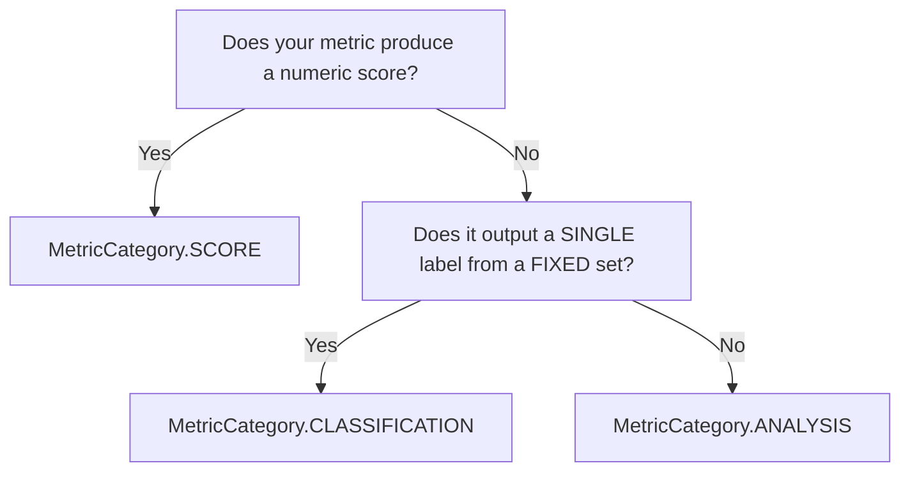

# Creating Custom Metrics

Axion provides a flexible framework for creating custom evaluation metrics. Whether you need an LLM to judge nuanced quality, a deterministic algorithm for fast checks, or a hybrid that combines both — every metric inherits from `BaseMetric` and plugs directly into the evaluation ecosystem.

## What You'll Learn

<div class="rule-grid" markdown="0">
<div class="rule-card">
<span class="rule-card__number">1</span>
<p class="rule-card__title">LLM-Powered</p>
<p class="rule-card__desc">Define an <code>instruction</code> and <code>examples</code> &mdash; the base class handles LLM calls, parsing, and scoring for you.</p>
</div>
<div class="rule-card">
<span class="rule-card__number">2</span>
<p class="rule-card__title">Algorithm-Based</p>
<p class="rule-card__desc">Override <code>execute()</code> with deterministic logic. No LLM needed &mdash; tag with <code>'heuristic'</code> and return a <code>MetricEvaluationResult</code>.</p>
</div>
<div class="rule-card">
<span class="rule-card__number">3</span>
<p class="rule-card__title">Hybrid</p>
<p class="rule-card__desc">Combine algorithmic pre-processing with LLM judgment and algorithmic aggregation in a single metric.</p>
</div>
<div class="rule-card">
<span class="rule-card__number">4</span>
<p class="rule-card__title">Registration & Usage</p>
<p class="rule-card__desc">Register via the <code>@metric</code> decorator or manually through the registry, then run with the evaluation runner.</p>
</div>
</div>

## Core Components

### BaseMetric Class

All custom metrics inherit from `BaseMetric`, which provides:

- **LLM Integration** - Built-in LLM handler with configurable models
- **Structured I/O** - Type-safe input/output with Pydantic models
- **Execution Framework** - Async execution with tracing and logging
- **Configuration Management** - Threshold and parameter handling
- **Validation** - Automatic field validation for dataset items

### Metric Decorator

The `@metric` decorator provides declarative configuration:

```python
@metric(
    name="Human-readable metric name",
    description="Detailed description of what the metric measures",
    required_fields=["field1", "field2"],
    optional_fields=["field3"],
    metric_category=MetricCategory.SCORE,  # SCORE, ANALYSIS, or CLASSIFICATION
    default_threshold=0.5,
    score_range=(0, 1),
    tags=["category", "domain"]
)
```

### Metric Categories

Axion supports three metric categories based on output type. Use `MetricCategory` to specify what kind of output your metric produces.

```python
from axion._core.types import MetricCategory
```

#### Decision Tree



#### Category Comparison

<div class="rule-grid" markdown="0">
<div class="rule-card">
<span class="rule-card__number">S</span>
<p class="rule-card__title">SCORE</p>
<p class="rule-card__desc">Numeric value (0&ndash;1) with pass/fail threshold. Aggregated via average or percentile. Example: <code>0.85</code></p>
</div>
<div class="rule-card">
<span class="rule-card__number">C</span>
<p class="rule-card__title">CLASSIFICATION</p>
<p class="rule-card__desc">Single label from a fixed set. Aggregated by label count. No pass/fail. Example: <code>"Property Condition"</code></p>
</div>
<div class="rule-card">
<span class="rule-card__number">A</span>
<p class="rule-card__title">ANALYSIS</p>
<p class="rule-card__desc">Structured object with open-ended insights. Custom aggregation. No pass/fail. Example: <code>{ category, reasons[], citations[] }</code></p>
</div>
</div>

#### When to Use Each Category

| Category | Use When | Examples |
|----------|----------|----------|
| **`SCORE`** | Metric produces a numeric value that can be compared to a threshold | `Faithfulness`, `AnswerRelevancy`, `Latency`, `acceptance_rate` |
| **`CLASSIFICATION`** | Metric produces a single categorical label from a fixed set | `SentimentClassification` → positive/negative/neutral |
| **`ANALYSIS`** | Metric extracts structured insights without scoring | `ReferralReasonAnalysis` → reasons, citations, categories |

#### Examples

**SCORE Metric** (default):
```python
@metric(
    name="Answer Quality",
    metric_category=MetricCategory.SCORE,  # Default, can be omitted
    default_threshold=0.7,
    score_range=(0, 1),
    ...
)
class AnswerQuality(BaseMetric):
    async def execute(self, item, **kwargs) -> MetricEvaluationResult:
        score = await self._evaluate(item)
        return MetricEvaluationResult(
            score=score,  # Numeric score required
            explanation="Quality assessment complete"
        )
```

**CLASSIFICATION Metric**:
```python
@metric(
    name="Sentiment Classification",
    metric_category=MetricCategory.CLASSIFICATION,
    required_fields=["actual_output"],
    ...
)
class SentimentClassification(BaseMetric):
    async def execute(self, item, **kwargs) -> MetricEvaluationResult:
        label = await self._classify(item.actual_output)
        return MetricEvaluationResult(
            score=None,  # No score for classification
            explanation=f"Classified as: {label}",
            signals={"label": label}  # Single categorical output
        )
```

**ANALYSIS Metric**:
```python
@metric(
    name="Referral Reason Analysis",
    metric_category=MetricCategory.ANALYSIS,
    required_fields=["actual_output"],
    ...
)
class ReferralReasonAnalysis(BaseMetric):
    async def execute(self, item, **kwargs) -> MetricEvaluationResult:
        result = await self._analyze(item)
        return MetricEvaluationResult(
            score=None,  # No score for analysis
            explanation=f"Extracted {len(result.reasons)} reasons",
            signals={  # Rich structured output
                "primary_category": result.primary_category,
                "all_reasons": result.reasons,
                "citations": result.citations,
                "actionable_type": result.actionable_type,
            }
        )
```

#### Downstream Behavior

| Behavior | `SCORE` | `CLASSIFICATION` | `ANALYSIS` |
|----------|---------|------------------|------------|
| `score` field | Required numeric | `None` → `np.nan` | `None` → `np.nan` |
| `passed` field | `True`/`False` based on threshold | `None` | `None` |
| `threshold` field | Set from config | `None` | `None` |
| Summary reports | Included in averages | Excluded from averages | Excluded from averages |
| Metadata | `metric_category: "score"` | `metric_category: "classification"` | `metric_category: "analysis"` |

### Field Mapping for Nested Inputs

If your dataset stores canonical fields under different names or nested paths, you can
map them at runtime using `field_mapping`. Mapped fields are used for validation and
lookup, so required fields still pass when they are sourced from alternate locations.

```python
from axion.metrics import AnswerCompleteness

metric = AnswerCompleteness(
    field_mapping={
        "actual_output": "additional_output.summary",
        "expected_output": "additional_input.reference",
    }
)
```

Paths use dot notation and traverse attributes or dict keys. For example, the mapping
above resolves `actual_output` from `item.additional_output["summary"]`.

## Building Your First Metric

The three tabs below walk through each approach — pick the one that fits your use case.

=== ":material-brain: LLM-Powered"

    For **pure LLM metrics**, you don't need to override `execute()` at all. Set the
    `instruction` and `examples` class attributes and the base class takes care of
    calling the LLM, parsing the response, and returning a `MetricEvaluationResult`.

    The `instruction` tells the LLM *what* to evaluate and *how* to score it.
    The `examples` list provides few-shot demonstrations that calibrate the LLM's
    scoring — include at least one high-score and one low-score example for consistency.

    ```python
    from axion.metrics.base import BaseMetric, MetricEvaluationResult, metric
    from axion.dataset import DatasetItem

    @metric(
        name="Answer Quality",
        description="Evaluates the overall quality of an answer based on clarity, completeness, and accuracy",
        required_fields=["actual_output"],
        optional_fields=["expected_output", "query"],
        default_threshold=0.7,
        score_range=(0, 1),
        tags=["quality", "general"]
    )
    class AnswerQuality(BaseMetric):
        """Evaluates answer quality across multiple dimensions."""

        instruction = """
        Evaluate the quality of the given answer based on the following criteria:
        1. Clarity - Is the answer clear and easy to understand?
        2. Completeness - Does the answer fully address the question?
        3. Accuracy - Is the information provided correct?
        Provide a score from 0 to 1, where:
        ....
        Provide a brief explanation for your score.
        """

        examples = [
            (
                DatasetItem(
                    query="What is photosynthesis?",
                    actual_output="Photosynthesis is the process by which plants convert sunlight, carbon dioxide, and water into glucose and oxygen. This process occurs in chloroplasts and is essential for plant survival and the oxygen we breathe."
                ),
                MetricEvaluationResult(
                    score=0.9,
                    explanation="Excellent answer that clearly explains photosynthesis, includes key components (sunlight, CO2, water, glucose, oxygen), mentions location (chloroplasts), and explains significance. Very clear and complete."
                )
            ),
            (
                DatasetItem(
                    query="How do you bake a cake?",
                    actual_output="Mix ingredients and bake."
                ),
                MetricEvaluationResult(
                    score=0.2,
                    explanation="Poor answer that lacks detail and completeness. Doesn't specify ingredients, quantities, temperatures, or timing. Too vague to be useful for someone wanting to bake a cake."
                )
            )
        ]
    ```

    !!! tip "No `execute()` needed"
        When you define `instruction` and `examples`, the `BaseMetric` base class
        automatically builds the prompt, calls the LLM, and parses the result.
        Only override `execute()` when you need custom logic.

=== ":material-calculator-variant: Algorithm-Based"

    For **deterministic, non-LLM metrics**, override `execute()` directly. This is
    ideal for pattern matching, coverage checks, latency measurements, or any logic
    that doesn't need an LLM judgment call.

    Use `self.get_field()` to access fields through the `field_mapping` layer, call
    `self._validate_required_metric_fields(item)` up front, and tag with `'heuristic'`
    so no LLM is provisioned.

    ```python
    import re
    from typing import Set

    from axion.metrics.base import BaseMetric, MetricEvaluationResult, metric
    from axion.dataset import DatasetItem

    @metric(
        name="Keyword Coverage",
        description="Measures how many expected keywords appear in the actual output",
        required_fields=["actual_output", "expected_keywords"],
        default_threshold=0.6,
        score_range=(0, 1),
        tags=["coverage", "keywords", "heuristic"]
    )
    class KeywordCoverage(BaseMetric):
        """Calculates the percentage of expected keywords found in the output."""

        async def execute(self, item: DatasetItem) -> MetricEvaluationResult:
            """Calculate keyword coverage score."""
            self._validate_required_metric_fields(item)

            actual_output = item.actual_output.lower()
            expected_keywords = item.expected_keywords

            if isinstance(expected_keywords, str):
                expected_keywords = [kw.strip() for kw in expected_keywords.split(',')]

            # Find keywords in output
            found_keywords = []
            missing_keywords = []

            for keyword in expected_keywords:
                keyword_lower = keyword.lower()
                if keyword_lower in actual_output:
                    found_keywords.append(keyword)
                else:
                    missing_keywords.append(keyword)

            # Calculate score
            score = len(found_keywords) / len(expected_keywords) if expected_keywords else 0.0

            # Generate explanation
            explanation = f"Found {len(found_keywords)}/{len(expected_keywords)} expected keywords. "
            if found_keywords:
                explanation += f"Found: {', '.join(found_keywords)}. "
            if missing_keywords:
                explanation += f"Missing: {', '.join(missing_keywords)}."

            return MetricEvaluationResult(
                score=score,
                explanation=explanation.strip()
            )
    ```

    !!! tip "Key differences from LLM metrics"
        - Override `execute()` with your own logic instead of setting `instruction`/`examples`
        - Tag with `'heuristic'` so no LLM handler is initialized
        - Return `MetricEvaluationResult` directly with a computed score and explanation

=== ":material-merge: Hybrid (LLM + Algorithm)"

    **Hybrid metrics** combine algorithmic pre-processing with LLM judgment and
    algorithmic post-processing. This is the pattern used by most metrics in Axion,
    as it is the bread and butter — extract structured data deterministically,
    let the LLM judge nuanced aspects, then aggregate the verdicts into a final score.

    The example below — `SourceVerification` — checks whether URLs cited in a
    response actually support the surrounding claims:

    1. **Algorithmic step**: Extract URLs and citation patterns via regex
    2. **LLM step**: For each citation, judge whether it supports the claim
    3. **Algorithmic step**: Aggregate verdicts into a final score

    ```python
    import re
    from typing import List

    from pydantic import Field

    from axion._core.schema import RichBaseModel
    from axion.dataset import DatasetItem
    from axion.metrics.base import BaseMetric, MetricEvaluationResult, metric

    # --- Pydantic models for the LLM judge ---

    class SourceVerdict(RichBaseModel):
        citation: str = Field(description="The citation text being judged.")
        supports_claim: bool = Field(
            description="True if the source likely supports the surrounding claim."
        )
        reason: str = Field(description="Brief reason for the verdict.")

    class SourceJudgeInput(RichBaseModel):
        claim_context: str = Field(description="The text surrounding the citation.")
        citations: List[str] = Field(description="Citations to judge.")

    class SourceJudgeOutput(RichBaseModel):
        verdicts: List[SourceVerdict] = Field(
            description="One verdict per citation."
        )

    # --- Inner LLM judge (structured output) ---

    class SourceJudge(BaseMetric[SourceJudgeInput, SourceJudgeOutput]):
        as_structured_llm = True
        input_model = SourceJudgeInput
        output_model = SourceJudgeOutput
        description = "Judges whether each citation supports its surrounding claim."
        instruction = """For each citation, decide whether the source it references
        is likely to support the claim in which it appears.

        A citation SUPPORTS the claim if:
        - The title, URL, or identifier clearly relates to the claim topic.
        - It is a primary or authoritative source for the stated fact.

        A citation DOES NOT SUPPORT the claim if:
        - It links to an unrelated topic or a generic homepage.
        - It appears fabricated or nonsensical."""

    # --- Main hybrid metric ---

    @metric(
        name="Source Verification",
        description="Verifies that cited sources support the claims they accompany",
        required_fields=["actual_output", "query"],
        default_threshold=0.7,
        score_range=(0, 1),
        tags=["citations", "verification", "hybrid"]
    )
    class SourceVerification(BaseMetric):
        """Hybrid metric: regex extraction → LLM judgment → algorithmic scoring."""

        def __init__(self, **kwargs):
            super().__init__(**kwargs)
            self.judge = SourceJudge(**kwargs)

        # Step 1 — Algorithmic: extract citations from text
        @staticmethod
        def _extract_citations(text: str) -> List[str]:
            citations = []
            seen = set()

            # Markdown links: [Title](URL)
            for match in re.finditer(r'\[([^\]]+)\]\((https?://[^\s\)]+)\)', text):
                url = match.group(2)
                if url not in seen:
                    citations.append(match.group(0))
                    seen.add(url)

            # Bare URLs not already captured
            for match in re.finditer(r'https?://[^\s<>"\')\]]+', text):
                url = match.group(0).rstrip('.,;:!?')
                if url not in seen:
                    citations.append(url)
                    seen.add(url)

            return citations

        async def execute(self, item: DatasetItem, **kwargs) -> MetricEvaluationResult:
            self._validate_required_metric_fields(item)

            # Step 1 — Algorithmic extraction
            citations = self._extract_citations(item.actual_output)

            if not citations:
                return MetricEvaluationResult(
                    score=0.0,
                    explanation="No citations found in the response."
                )

            # Step 2 — LLM judgment
            judge_output = await self.judge.execute(
                claim_context=item.actual_output,
                citations=citations,
            )

            # Step 3 — Algorithmic aggregation
            supported = sum(1 for v in judge_output.verdicts if v.supports_claim)
            score = supported / len(citations)

            # Cost tracking (only the LLM component)
            self.compute_cost_estimate([self.judge])

            explanation = (
                f"Source Verification Score: {score:.2f} "
                f"({supported}/{len(citations)} citations support their claims)."
            )

            return MetricEvaluationResult(score=score, explanation=explanation)
    ```

    !!! info "Pattern breakdown"
        | Step | Type | What happens |
        |------|------|-------------|
        | Extract citations | Algorithm | Regex finds URLs and markdown links — fast, deterministic |
        | Judge relevance | LLM | Structured output model returns per-citation verdicts |
        | Aggregate score | Algorithm | `supported / total` — no LLM needed for the math |

        This pattern keeps LLM costs proportional to the *number of citations*, not
        the length of the full response, and gives you a deterministic aggregation
        you can unit-test independently.

## Registration Methods

### Automatic Registration with Decorator

The `@metric` decorator automatically registers metrics:

```python
@metric(
    name="Custom Metric",
    description="Description of the metric",
    required_fields=["field1", "field2"],
    default_threshold=0.5
)
class CustomMetric(BaseMetric):
    # Metric implementation
    pass

# Metric is automatically available in registry
from axion.metrics import metric_registry
metric_class = metric_registry.get("custom_metric")
```

### Manual Registration

For dynamic registration or when decorators aren't suitable:

```python
from axion.metrics.base import MetricConfig
from axion.metrics import metric_registry

class DynamicMetric(BaseMetric):
    """Dynamically configured metric."""
    pass

# Create configuration
config = MetricConfig(
    key="dynamic_metric",
    name="Dynamic Metric",
    description="A dynamically registered metric",
    required_fields=["actual_output"],
    optional_fields=[],
    default_threshold=0.6,
    score_range=(0, 1),
    tags=["dynamic"]
)

# Attach config and register
DynamicMetric.config = config
metric_registry.register(DynamicMetric)
```

## Usage Examples

### Using Custom Metrics

```python
from axion.dataset import DatasetItem

# Initialize your custom metric
metric = AnswerQuality()

# Prepare test data
data_item = DatasetItem(
    query="How do I reset my password?",
    actual_output="To reset your password, click 'Forgot Password' on the login page and follow the email instructions.",
    expected_output="Navigate to login, click 'Forgot Password', and follow the reset link sent to your email.",
    retrieved_content=["Password reset available via login page", "Reset link sent by email"]
)

# Execute evaluation
result = await metric.execute(data_item)
print(f"Score: {result.score}")
print(f"Explanation: {result.explanation}")

# Pretty print results
print(result.pretty())
```

### Running with the Evaluation Runner

For batch evaluation across a full dataset, use `evaluation_runner`:

```python
from axion import Dataset
from axion.runners import evaluation_runner

dataset = Dataset(items=[...])
metrics = [AnswerQuality(), KeywordCoverage()]

results = await evaluation_runner(dataset=dataset, metrics=metrics)
```

## Best Practices

### Metric Design
- **Single Responsibility** - Each metric should evaluate one specific aspect
- **Clear Scoring** - Use consistent scoring scales and document ranges
- **Robust Validation** - Validate inputs thoroughly and provide helpful error messages
- **Comprehensive Examples** - Include diverse examples that cover edge cases

### Error Handling
- **Graceful Degradation** - Provide fallback scores when computation fails
- **Informative Messages** - Return helpful error messages and explanations
- **Input Validation** - Validate inputs early and provide clear requirements
- **Logging** - Use appropriate logging levels for debugging and monitoring

### Performance
- **`shares_internal_cache`** - Set to `True` when multiple metrics can reuse intermediate results (e.g., claim extraction shared between Faithfulness and Citation metrics)
- **`compute_cost_estimate()`** - Call with your inner LLM components to surface estimated token costs in evaluation reports
- **Heuristic tagging** - Include `'heuristic'` in `tags` for algorithm-only metrics so no LLM handler is initialized, reducing startup overhead

---

<div class="ref-nav" markdown="1">

[Metrics Guide :octicons-arrow-right-24:](../../guides/metrics.md){ .md-button .md-button--primary }
[Running Evaluations :octicons-arrow-right-24:](../../guides/evaluation.md){ .md-button }
[Metrics Reference :octicons-arrow-right-24:](../../reference/metrics.md){ .md-button }

</div>
