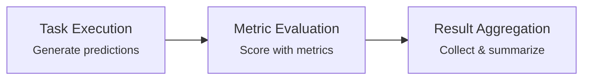

# Evaluation Runner

The Evaluation Runner orchestrates end-to-end evaluation experiments — from generating model predictions to scoring them with multiple metrics. It unifies task execution, metric evaluation, and result aggregation into a single workflow with built-in caching, error handling, tracing, and key remapping.

## What You'll Learn

<div class="rule-grid" markdown="0">
<div class="rule-card">
<span class="rule-card__number">1</span>
<p class="rule-card__title">Task Execution</p>
<p class="rule-card__desc">Optionally generate model outputs with a custom task function before scoring &mdash; sync, async, dict, or Pydantic.</p>
</div>
<div class="rule-card">
<span class="rule-card__number">2</span>
<p class="rule-card__title">Metric Evaluation</p>
<p class="rule-card__desc">Score outputs with any combination of Axion, Ragas, and DeepEval metrics in parallel.</p>
</div>
<div class="rule-card">
<span class="rule-card__number">3</span>
<p class="rule-card__title">Caching & Errors</p>
<p class="rule-card__desc">Cache task outputs and metric results to disk or memory. Configure error handling per experiment.</p>
</div>
<div class="rule-card">
<span class="rule-card__number">4</span>
<p class="rule-card__title">Tracing</p>
<p class="rule-card__desc">Automatic integration with Langfuse and Opik for full observability of every LLM call and metric execution.</p>
</div>
</div>

## Overview

The Evaluation Runner combines three phases into a single workflow:



```python title="View Documentation & Usage Examples"
from axion.runners import EvaluationRunner

# Display inline documentation and usage examples
EvaluationRunner.display()
```

## Getting Started

=== ":material-play: Basic (No Task)"

    When your dataset already contains model outputs, skip the task phase and go
    straight to evaluation. Pass `evaluation_inputs` and `scoring_metrics` — the
    runner handles the rest.

    ```python
    from axion.runners import evaluation_runner
    from axion.metrics import AnswerRelevancy
    from axion.dataset import DatasetItem

    # Prepare dataset with existing outputs
    dataset = [
        DatasetItem(
            query="How do I reset my password?",
            actual_output="To reset your password, click 'Forgot Password' on the login page...",
            expected_output="Navigate to login, click 'Forgot Password', and follow the reset link."
        ),
        # More items...
    ]

    # Run evaluation only
    results = evaluation_runner(
        evaluation_inputs=dataset,
        scoring_metrics=[AnswerRelevancy()],
        evaluation_name="Basic Evaluation"
    )

    print(f"Evaluation Name: {results.evaluation_name}")
    print(f"Success rate: {results.success_rate}")
    ```

=== ":material-robot: With Task"

    For end-to-end evaluation, provide a `task` function that generates outputs from
    each `DatasetItem`. The task can return a `dict`, a Pydantic `BaseModel`, or use
    an API runner. Use `scoring_key_mapping` when task output keys don't match metric
    input fields.

    ```python
    from axion.runners import evaluation_runner, CacheConfig
    from axion.metrics import AnswerRelevancy, Latency
    from axion.dataset import DatasetItem

    data_item = DatasetItem(
        query="How do I reset my password?",
        expected_output="Navigate to login, click 'Forgot Password', and follow the reset link.",
    )

    # Task returns a dictionary (can be async or sync)
    def my_task(item):
        return {
            'response': "To reset your password, click 'Forgot Password' on the login page.",
            'latency': 1.3
        }

    results = evaluation_runner(
        evaluation_inputs=[data_item],
        task=my_task,
        scoring_metrics=[
            AnswerRelevancy(model_name='gpt-4o'),
            Latency(threshold=1.5),
        ],
        max_concurrent=5,
        scoring_key_mapping={'actual_output': 'response'},  # Map task keys → metric fields
        evaluation_name='Custom Setup',
        evaluation_metadata={"model_version": "v2.1"},
        cache_config=CacheConfig(use_cache=True),
    )

    results.to_dataframe()   # Pandas DataFrame
    results.to_scorecard()   # Visual scorecard
    ```

=== ":material-library: Multi-Library"

    Mix metrics from Axion, Ragas, and DeepEval in a single evaluation run.
    Each metric is automatically routed to the correct executor.

    ```python
    from axion.runners import (
        EvaluationRunner, EvaluationConfig,
        CacheConfig, ErrorConfig,
    )
    from axion.metrics import AnswerCompleteness, Latency
    from axion.integrations.models import LiteLLMRagas, LiteLLMDeepEval

    import pandas as pd
    from ragas.metrics import Faithfulness
    from deepeval.metrics import AnswerRelevancyMetric

    # Create evaluation dataset
    dataframe = pd.DataFrame([
        {
            'id': '01',
            'query': "How do I reset my password?",
            'expected_output': "Navigate to login, click 'Forgot Password', and follow the reset link.",
        },
        {
            'id': '02',
            'query': "How do I update my billing information?",
            'expected_output': "Go to Account Settings, select Billing, and update your payment method.",
        }
    ])

    # Define evaluation metrics across frameworks
    metrics = [
        Faithfulness(llm=LiteLLMRagas()),
        AnswerCompleteness(model_name='gpt-4'),
        AnswerRelevancyMetric(model=LiteLLMDeepEval()),
        Latency(threshold=8)
    ]

    # Configure the evaluation
    config = EvaluationConfig(
        evaluation_name="Advanced Configuration Eval",
        evaluation_inputs=dataframe,
        scoring_metrics=metrics,
        task=api_runner,
        max_concurrent=10,
        cache_config=CacheConfig(use_cache=True, cache_type='memory'),
        error_config=ErrorConfig(skip_on_missing_params=True),
        thresholds={"faithfulness": 0.8, "answer_completeness": 0.7},
        evaluation_metadata={"model_version": "v2.1"},
        dataset_name='Advanced Configuration Dataset'
    )

    # Run the evaluation
    runner = EvaluationRunner(config)
    results = await runner.execute()

    results.to_dataframe()
    results.to_scorecard()
    ```

## Configuration

=== ":material-function: Function Call"

    Pass parameters directly to `evaluation_runner()` for quick, inline configuration.

    ```python
    from axion.runners import evaluation_runner

    results = evaluation_runner(
        evaluation_inputs=dataset,
        scoring_metrics=[AnswerRelevancy()],
        evaluation_name="My Experiment",
        task=my_task_function,
        max_concurrent=10,
        thresholds={"question_answer_relevance": 0.75}
    )
    ```

=== ":material-cog: Config Object"

    Use `EvaluationConfig` for reusable, shareable configurations.

    ```python
    from axion.runners import EvaluationRunner, EvaluationConfig, CacheConfig

    config = EvaluationConfig(
        evaluation_name="Advanced Experiment",
        evaluation_inputs=dataset,
        scoring_metrics=metrics,
        task=generation_task,
        scoring_key_mapping={'actual_output': 'response'},
        evaluation_description="Evaluating new model version",
        evaluation_metadata={"model_version": "v2.1"},
        cache_config=CacheConfig(use_cache=True),
        max_concurrent=5,
        show_progress=True
    )

    runner = EvaluationRunner(config)
    results = await runner.execute()
    ```

## Task Functions

Task functions generate model outputs for evaluation. They accept a `DatasetItem` and
return output data. Supports both sync and async functions.

=== ":material-code-braces: Dict Return"

    ```python
    def simple_task(item: DatasetItem) -> Dict[str, Any]:
        """Simple synchronous task function."""
        response = your_model.generate(item.query)

        return {
            'actual_output': response,
            'generation_time': time.time()
        }
    ```

=== ":material-shape: Pydantic Return"

    ```python
    from pydantic import BaseModel

    class Output(BaseModel):
        response: str
        latency: float

    def pydantic_task(item: DatasetItem) -> Output:
        return Output(
            response="To reset your password...",
            latency=1.3
        )
    ```

=== ":material-api: API Runner"

    ```python
    from axion.runners import APIRunner

    api_runner = APIRunner(config={'my_chatbot': {'api_url': '...', 'api_key': '...'}})

    # Pass the API runner directly as the task
    results = evaluation_runner(
        evaluation_inputs=dataset,
        task=api_runner,
        scoring_metrics=metrics,
        scoring_key_mapping={'actual_output': 'response'},
        evaluation_name="API Evaluation"
    )
    ```

## Key Remapping

Use `scoring_key_mapping` to bridge the gap between task output keys and metric input fields:

```python
# Your task returns this structure
task_output = {
    'generated_text': "The answer is...",
    'source_documents': ["doc1", "doc2"],
    'model_confidence': 0.95
}

# But metrics expect this structure
metric_expected = {
    'actual_output': "The answer is...",
    'retrieved_content': ["doc1", "doc2"]
}

# Use key mapping to bridge the gap
scoring_key_mapping = {
    'actual_output': 'generated_text',
    'retrieved_content': 'source_documents',
}

results = evaluation_runner(
    evaluation_inputs=dataset,
    task=my_task,
    scoring_metrics=metrics,
    scoring_key_mapping=scoring_key_mapping,
    evaluation_name="Mapped Evaluation"
)
```

## Response Format

The Evaluation Runner returns an `EvaluationResult` object:

| Field | Type | Description |
|-------|------|-------------|
| `run_id` | `str` | Unique identifier for this evaluation run |
| `evaluation_name` | `str` | Name of the evaluation |
| `timestamp` | `str` | ISO-formatted execution timestamp |
| `results` | `List[TestResult]` | Detailed results for each evaluation input |
| `summary` | `Dict[str, Any]` | Summary of the TestResult objects |
| `metadata` | `Dict[str, Any]` | Evaluation metadata and configuration |

Each `TestResult` contains the same structure as described in the [Metric Runner documentation](metric-runner.md#response-format).

## Advanced Features

=== ":material-cached: Caching"

    Cache task outputs and metric results to avoid re-computation across runs.
    `'memory'` is fast but non-persistent; `'disk'` persists across runs.

    ```python
    from axion.runners import CacheConfig

    cache_config = CacheConfig(
        use_cache=True,          # Enable caching
        cache_task=True,         # Cache task outputs
        cache_type='disk',
        cache_dir='cache/',
    )

    results = evaluation_runner(
        evaluation_inputs=dataset,
        task=expensive_task,
        scoring_metrics=metrics,
        cache_config=cache_config,
        evaluation_name="Cached Evaluation"
    )
    ```

=== ":material-lightning-bolt: Prompt Caching"

    Enable provider-level prompt caching to reduce cost and latency when evaluating
    many items. When enabled, the system prompt and few-shot examples prefix is marked
    as cacheable — providers reuse the cached prefix across items instead of
    re-processing it on every call.

    ```python
    from axion.runners import evaluation_runner
    from axion.metrics import Faithfulness, AnswerRelevancy

    # Option 1: Runner-level (applies to all metrics)
    results = evaluation_runner(
        evaluation_inputs=dataset,
        scoring_metrics=[Faithfulness(), AnswerRelevancy()],
        evaluation_name="Cached Evaluation",
        enable_prompt_caching=True,
    )

    # Option 2: Per-metric (granular control)
    results = evaluation_runner(
        evaluation_inputs=dataset,
        scoring_metrics=[
            Faithfulness(enable_prompt_caching=True),
            AnswerRelevancy(),  # caching disabled for this metric
        ],
        evaluation_name="Selective Caching",
    )
    ```

    **Provider behavior:**

    | Provider | Behavior |
    |----------|----------|
    | Anthropic | Explicit caching with 5-min TTL; ~90% savings on cached reads |
    | OpenAI | Automatic caching for prompts >1024 tokens; markers are harmless |
    | Others | LiteLLM silently ignores markers for unsupported providers |

    !!! note "Minimum prefix length"
        Caching requires the shared prefix (system prompt + few-shot examples) to
        exceed the provider's minimum: **1024 tokens** for most Anthropic/OpenAI models,
        **2048 tokens** for Claude Haiku. Metrics with short prompts and no examples
        may not benefit.

    When tracing is enabled, each LLM span includes a `cached_tokens` attribute
    for observability.

=== ":material-tag: Metadata & Tracking"

    Attach metadata to evaluation runs for experiment tracking and reproducibility.

    ```python
    results = evaluation_runner(
        evaluation_inputs=dataset,
        task=task,
        scoring_metrics=metrics,
        evaluation_name="Model Comparison v2.1",
        evaluation_description="Comparing new model against baseline",
        evaluation_metadata={
            'model_version': 'v2.1.0',
            'baseline_version': 'v1.9.2',
            'dataset_version': 'eval_set_march_2024',
            'environment': 'staging',
            'researcher': 'data_science_team',
            'tags': ['comparison', 'monthly_eval', 'production_candidate']
        },
        run_id="evaluation_2024_03_15_001"
    )

    # Access metadata in results
    print(f"Model version: {results.metadata['model_version']}")
    print(f"Environment: {results.metadata['environment']}")
    ```

=== ":material-chart-timeline-variant: Tracing"

    The runner automatically integrates with Axion's tracing system. When tracing is
    enabled (Langfuse or Opik), you get full observability of every LLM call.

    **Trace granularity** controls how traces are organized:

    | Mode | Description | Use Case |
    |------|-------------|----------|
    | `single_trace` | All evaluations under one parent trace (default) | Viewing entire evaluation as one unit |
    | `separate` | Each metric execution gets its own trace | Detailed per-item analysis |

    ```python
    results = evaluation_runner(
        evaluation_inputs=dataset,
        scoring_metrics=[AnswerRelevancy()],
        evaluation_name="RAG Quality Check",
        trace_granularity='single_trace'  # or 'separate'
    )
    ```

    **Trace hierarchy** produced by the runner:

    ```
    RAG Quality Check v2                          # evaluation_name (root span)
    ├─ AnswerRelevancy.execute                    # Metric logic span
    │  └─ litellm_structured                      # LLM formatting/parsing
    │     └─ llm_call                             # LLM API call (cost/tokens)
    └─ Faithfulness.execute
       └─ litellm_structured
          └─ llm_call
    ```

    **Enabling tracing:**

    ```python
    import os
    os.environ['TRACING_MODE'] = 'langfuse'
    os.environ['LANGFUSE_PUBLIC_KEY'] = 'pk-lf-...'
    os.environ['LANGFUSE_SECRET_KEY'] = 'sk-lf-...'
    os.environ['LANGFUSE_BASE_URL'] = 'https://us.cloud.langfuse.com'

    from axion._core.tracing import configure_tracing
    configure_tracing()

    # Now run your evaluation - traces are automatically captured
    results = evaluation_runner(
        evaluation_inputs=dataset,
        scoring_metrics=metrics,
        evaluation_name="My Evaluation"
    )
    ```

    See the [Tracing Documentation](../internals/tracing.md) for more configuration options.

---

<div class="ref-nav" markdown="1">

[Runners API Reference :octicons-arrow-right-24:](../../reference/runners.md){ .md-button .md-button--primary }
[Metric Runner Deep Dive :octicons-arrow-right-24:](metric-runner.md){ .md-button }
[API Runner Deep Dive :octicons-arrow-right-24:](api-runner.md){ .md-button }

</div>
