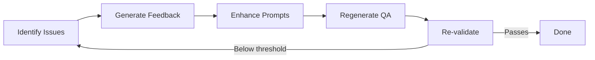

# Document Synthetic QA Generation

The Synthetic QA Generation System provides a user flexible solution for creating question-answer pairs from unstructured documents. This system enables scalable generation of evaluation datasets for RAG models and other conversational systems through an intelligent, multi-stage workflow with built-in quality validation.


> Note:
>  This is build as an agentic workflow and will trigger multiple LLM calls, so please be mindful of potential rate limits and associated costs.


### Pipeline Stages

<div class="rule-grid" markdown="0">
<div class="rule-card">
<span class="rule-card__number">1</span>
<p class="rule-card__title">Document Ingestion</p>
<p class="rule-card__desc">Load and prepare documents from directories.</p>
</div>
<div class="rule-card">
<span class="rule-card__number">2</span>
<p class="rule-card__title">Content Chunking</p>
<p class="rule-card__desc">Intelligent splitting while preserving context.</p>
</div>
<div class="rule-card">
<span class="rule-card__number">3</span>
<p class="rule-card__title">Statement Extraction</p>
<p class="rule-card__desc">Extract factual, standalone statements from chunks.</p>
</div>
<div class="rule-card">
<span class="rule-card__number">4</span>
<p class="rule-card__title">Question Generation</p>
<p class="rule-card__desc">Create diverse questions across multiple types.</p>
</div>
<div class="rule-card">
<span class="rule-card__number">5</span>
<p class="rule-card__title">Answer Generation</p>
<p class="rule-card__desc">Generate accurate, grounded answers.</p>
</div>
<div class="rule-card">
<span class="rule-card__number">6</span>
<p class="rule-card__title">Validation & Reflection</p>
<p class="rule-card__desc">Quality assessment with iterative improvement.</p>
</div>
</div>

#### Langraph Workflow


### Key Components

<div class="rule-grid" markdown="0">
<div class="rule-card">
<span class="rule-card__number">&#x2713;</span>
<p class="rule-card__title">DocumentQAGenerator</p>
<p class="rule-card__desc">Main orchestrator for the entire pipeline.</p>
</div>
<div class="rule-card">
<span class="rule-card__number">&#x2713;</span>
<p class="rule-card__title">GenerationParams</p>
<p class="rule-card__desc">Configuration object for all generation parameters.</p>
</div>
<div class="rule-card">
<span class="rule-card__number">&#x2713;</span>
<p class="rule-card__title">QAWorkflowGraph</p>
<p class="rule-card__desc">A LangGraph-based workflow execution engine.</p>
</div>
<div class="rule-card">
<span class="rule-card__number">&#x2713;</span>
<p class="rule-card__title">Quality Validators</p>
<p class="rule-card__desc">Multi-dimensional assessment and feedback.</p>
</div>
</div>

---

> ### Important Note
> Synthetic data generation with LLMs is **not** a one-size-fits-all process.
> The quality and usefulness of generated data depend heavily on the prompts you use—both during the **answer generation phase** and within your **actual production model**.
>
> **Best Practice:** Reverse-engineer your real application’s instructions when creating meta-prompts.
> Provide the generation LLM with a realistic example question and answer that mirrors your production setup.
>
> This matters because you’re effectively working with **two different prompt contexts**:
>
> 1. **Generation LLM’s prompt** – used to produce synthetic answers.
> 2. **Your real model’s prompt** – used during inference in your application.
>
> If these prompts differ significantly, the resulting style, tone, and level of detail can vary widely—leading to synthetic data that doesn’t truly represent your production environment.
> Aligning them ensures **consistency** and **reliability** in evaluation and training.

---

## Configuration

### GenerationParams

The `GenerationParams` class provides comprehensive configuration for the generation process:

```python
from axion.synthetic import GenerationParams

params = GenerationParams(
    # Content Processing
    splitter_type="semantic",                    # or "sentence"
    chunk_size=2048,                            # For sentence splitter
    breakpoint_percentile_threshold=95,         # For semantic splitter

    # Generation Control
    num_pairs=1,                                # Number of QA pairs to generate
    statements_per_chunk=5,                     # Statements extracted per chunk

    # Question Configuration
    question_types=["factual", "analytical"],   # Types of questions
    difficulty="medium",                        # easy, medium, hard

    # Answer Configuration
    answer_length="medium",                     # short, medium, long

    # Quality Control
    validation_threshold=0.8,                   # Quality threshold (0-1)
    max_reflection_iterations=3,                # Max improvement iterations

    # Customization
    custom_guidelines="Focus on technical accuracy",
    example_question="What is the primary function of X?",
    example_answer="The primary function of X is..."
)
```

## Usage Patterns

### Configuration Options

```python
from axion.synthetic import DocumentQAGenerator, GenerationParams
import pandas as pd
params = GenerationParams(
    # Content processing
    splitter_type="semantic",
    breakpoint_percentile_threshold=90,
    statements_per_chunk=8,

    # Generation scope
    num_pairs=1,
    question_types=["factual", "conceptual", "analytical", "application"],
    difficulty="easy",
    answer_length="long",

    # Quality requirements
    validation_threshold=0.85,
    max_reflection_iterations=5,

    # Domain customization
    custom_guidelines="""
    Focus on technical accuracy and real-world applications.
    Emphasize practical implementation details.
    Include architectural considerations where relevant.
    """,

    example_question="How would you implement X in a production environment?",
    example_answer="To implement X in production, you would need to consider..."
)

qa_generator = DocumentQAGenerator(
    llm=llm,
    params=params,
    embed_model=embed_model, # required for semantic splitting
    max_concurrent=3  # Conservative for complex processing
)
# Generate QA pairs from directory
results = await qa_generator.generate_from_directory('path/to/documents/')
pd.DataFrame(results)
```

## Parameter Reference

### Content Processing Parameters

| Parameter | Type | Default | Description |
|-----------|------|---------|-------------|
| `splitter_type` | `"semantic"` \| `"sentence"` | `"sentence"` | Text splitting strategy |
| `chunk_size` | `int` | `2048` | Target chunk size for sentence splitter |
| `breakpoint_percentile_threshold` | `int` | `95` | Semantic similarity threshold (80-100) |
| `statements_per_chunk` | `int` | `5` | Number of statements to extract per chunk |

### Generation Control Parameters

| Parameter | Type | Default | Description |
|-----------|------|---------|-------------|
| `num_pairs` | `int` | `10` | Total QA pairs to generate (1-100) |
| `question_types` | `List[str]` | `["factual", "analytical"]` | Types of questions to generate |
| `difficulty` | `"easy"` \| `"medium"` \| `"hard"` | `"medium"` | Question complexity level |
| `answer_length` | `"short"` \| `"medium"` \| `"long"` | `"medium"` | Target answer length |

### Quality Control Parameters

| Parameter | Type | Default | Description |
|-----------|------|---------|-------------|
| `validation_threshold` | `float` | `0.8` | Minimum quality score (0.0-1.0) |
| `max_reflection_iterations` | `int` | `3` | Maximum improvement iterations (1-10) |

### Customization Parameters

| Parameter | Type | Default | Description |
|-----------|------|---------|-------------|
| `custom_guidelines` | `str` | `None` | Additional generation instructions |
| `example_question` | `str` | `None` | Example question for style guidance |
| `example_answer` | `str` | `None` | Example answer for style guidance |


## Quality Validation

### Validation Dimensions

The system evaluates QA pairs across five dimensions:

<div class="rule-grid" markdown="0">
<div class="rule-card">
<span class="rule-card__number">1</span>
<p class="rule-card__title">Accuracy</p>
<p class="rule-card__desc">Is the answer factually correct and well-grounded?</p>
</div>
<div class="rule-card">
<span class="rule-card__number">2</span>
<p class="rule-card__title">Completeness</p>
<p class="rule-card__desc">Does it fully address the question?</p>
</div>
<div class="rule-card">
<span class="rule-card__number">3</span>
<p class="rule-card__title">Relevance</p>
<p class="rule-card__desc">Is it directly aligned with the question?</p>
</div>
<div class="rule-card">
<span class="rule-card__number">4</span>
<p class="rule-card__title">Clarity</p>
<p class="rule-card__desc">Is the language clear and understandable?</p>
</div>
<div class="rule-card">
<span class="rule-card__number">5</span>
<p class="rule-card__title">Factual Integrity</p>
<p class="rule-card__desc">Does it avoid hallucination or extraneous information?</p>
</div>
</div>

### Reflection Process

When QA pairs fall below the validation threshold:




### Integration with Evaluation

This system is built into the `Dataset` class within Axion.

```python
from axion.synthetic.schema import GenerationParams
from axion.dataset import Dataset

dataset = Dataset(name='Product-Growth-Knowledge')

params = GenerationParams(
    num_pairs=1,
    question_types=["factual", "conceptual", "application"],
    difficulty="medium",
    max_chunk_size=4000,
    statements_per_chunk=5,
    answer_length="medium",
    splitter_type="sentence",
    custom_guidelines="Focus on application scenarios in the questions.",
    max_reflection_iterations=3,
    validation_threshold=0.7
)

dataset.synthetic_generate_from_directory(
    directory_path='small_docs/',
    llm=llm,
    params=params
)
```

---

<div class="ref-nav" markdown="1">

[Synthetic API Reference :octicons-arrow-right-24:](../../reference/synthetic.md){ .md-button .md-button--primary }
[Datasets Guide :octicons-arrow-right-24:](../../guides/datasets.md){ .md-button }

</div>
