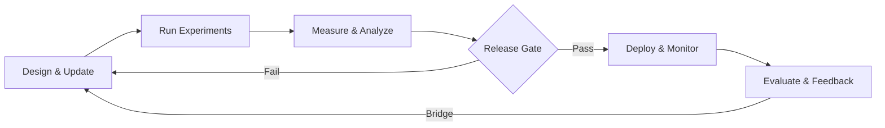

# The Evaluation Flywheel

Lifecycle

Build. Test. Deploy. <em>Learn. Repeat.</em>

The Evaluation Flywheel is a continuous process for building, testing, deploying, and improving AI models. It's called a "flywheel" because feedback from production accelerates improvements in development, building momentum over time.

The lifecycle consists of two interconnected loops:

1

Pre-Production (The Lab)

Validate before release. Test challengers against baselines using golden datasets and ground truth.

2

Post-Production (The Real World)

Confirm value in practice. Monitor drift, measure business impact, and collect user feedback.

---

## Loop 1: Pre-Production

A controlled environment where you test models without affecting real users.

**Goal:** Validate that the new model is better than the current one—and hasn't broken anything that used to work.

### Process

1

Design & Update

Create new model versions to address needs or fix problems.

2

Run Experiments

Test the "Challenger" model against the "Baseline" using golden datasets.

3

Measure

Quantify results against ground truth with targeted metrics.

4

Analyze

Check for improvements, regressions, and safety issues.

### What You Need

- **Golden Datasets** — Curated examples with known correct answers
- **Ground Truth** — The definitive "right answer" for each test case

### Key Metrics

| Metric | What It Measures |
|--------|------------------|
| Accuracy | How often the model is correct |
| Relevance | How well answers match the question |
| Groundedness | Whether answers are based on facts |
| Safety | Whether outputs avoid harmful content |

### Exit Criteria

A model leaves this loop only when it:

- Passes all safety checks
- Shows accuracy improvements
- Has zero regressions on existing capabilities

---

## The Release Gate

Deployment Decision

Between the two loops sits a mandatory checkpoint. Models cannot move to production unless they meet all Loop 1 criteria. Failed models return to the design phase. Passing models get promoted.

---

## Loop 2: Post-Production

The live environment where real users interact with your model.

**Goal:** Confirm that Lab results translate to real-world value, and maintain parity between offline and live performance.

### Process

1

Deploy & Adapt

Release the model and handle real traffic at scale.

2

Monitor

Watch for drift when real-world data diverges from training data.

3

Evaluate Value

Measure business impact and user outcomes against expectations.

4

Integrate Feedback

Collect user signals and analyze usage patterns for the next cycle.

### What You Need

- **Session Traces** — Real interaction data from live users
- **Feedback Channels** — User ratings, support tickets, behavioral signals

### Key Metrics

| Metric | What It Measures |
|--------|------------------|
| Business KPIs | Revenue, conversion, retention impact |
| Usage | Adoption, engagement, feature utilization |
| Efficacy | Whether users actually solve their problems |

### Critical Check: Prod-Test Parity

Ask: *"Are live scores matching Lab scores?"*

If Lab accuracy was 95% but production accuracy is 70%, something is wrong. This gap signals a problem with your testing methodology or data distribution.

### Success Criteria

- Positive ROI
- Production metrics match offline predictions

---

## The Bridge: Closing the Loop

The arrow at the bottom of the diagram—**The Bridge**—is what makes this a flywheel. It feeds real-world data back into the Lab.

- **Sampled logs** become training and tuning data
- **Production failures** become new test cases

!!! tip "Failures Are Assets"
    Every production failure gets added to your golden datasets. This ensures the next model version is specifically tested against that scenario—preventing the same mistake twice.

This continuous feedback loop drives constant improvement. Each cycle through the flywheel makes your evaluation more comprehensive and your models more robust.

[Agent Evaluation Playbook :octicons-arrow-right-24:](agent_playbook.md){ .md-button .md-button--primary }
[Why Ground Truth Matters :octicons-arrow-right-24:](why_ground_truth_matters.md){ .md-button }
