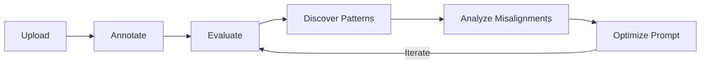
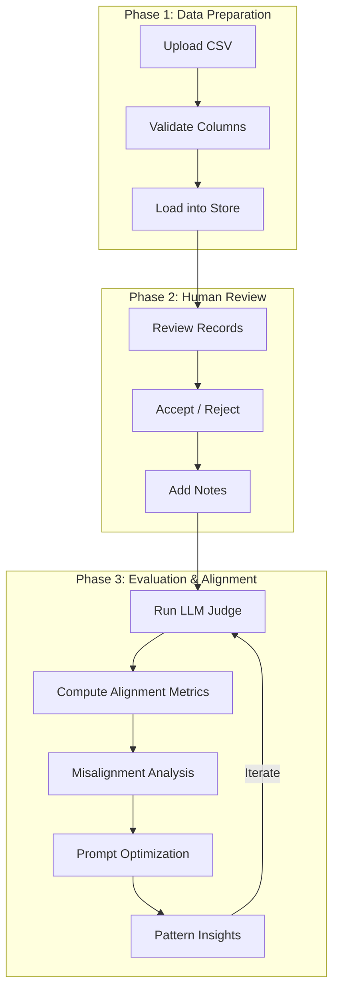
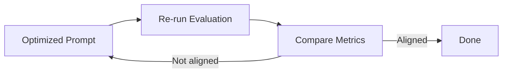

# CaliberHQ

CaliberHQ is a toolkit for calibrating **LLM-as-a-judge** evaluators against a **human-labeled baseline**. Instead of writing rubrics in the abstract, you work backward from real outputs so the evaluator learns what actually matters for your use case.

## Quick start

```python
from axion.caliber import CalibrationSession

session = CalibrationSession()

# 1) Upload your data
session.upload_records(
    [
        {"id": "r1", "query": "…", "actual_output": "…"},
        {"id": "r2", "query": "…", "actual_output": "…"},
    ]
)

# 2) Add human annotations
session.annotate("r1", score=1, notes="Good response")
session.annotate("r2", score=0, notes="Factually incorrect")

# 3) Run LLM evaluation + alignment metrics
result = await session.evaluate(
    criteria="Score 1 if accurate and helpful, 0 otherwise",
    model_name="gpt-4o",
    llm_provider="openai",
)

print(f"Accuracy: {result.metrics.accuracy:.1%}")
print(f"Cohen's Kappa: {result.metrics.cohen_kappa:.3f}")
```

## The 6-step workflow

<div class="rule-grid" markdown="0">
<div class="rule-card">
<span class="rule-card__number">1</span>
<p class="rule-card__title">Upload</p>
<p class="rule-card__desc">Load your evaluation data from CSV or programmatically.</p>
</div>
<div class="rule-card">
<span class="rule-card__number">2</span>
<p class="rule-card__title">Annotate</p>
<p class="rule-card__desc">Add human judgments (Accept=1, Reject=0) with optional notes.</p>
</div>
<div class="rule-card">
<span class="rule-card__number">3</span>
<p class="rule-card__title">Evaluate</p>
<p class="rule-card__desc">Run the LLM judge and compute alignment metrics (accuracy, kappa, F1).</p>
</div>
<div class="rule-card">
<span class="rule-card__number">4</span>
<p class="rule-card__title">Discover Patterns</p>
<p class="rule-card__desc">Cluster annotation notes into themes (LLM / BERTopic / hybrid).</p>
</div>
<div class="rule-card">
<span class="rule-card__number">5</span>
<p class="rule-card__title">Analyze Misalignments</p>
<p class="rule-card__desc">Examine false positives and false negatives (judge vs human).</p>
</div>
<div class="rule-card">
<span class="rule-card__number">6</span>
<p class="rule-card__title">Optimize</p>
<p class="rule-card__desc">Produce improved evaluation criteria based on misalignment patterns.</p>
</div>
</div>



## Usage Patterns

=== ":material-rocket-launch: Session-Based (Recommended)"

    Use `CalibrationSession` for state management and serialization. Good for
    scripts, web APIs, and notebooks.

    ```python
    from axion.caliber import CalibrationSession

    session = CalibrationSession()
    session.upload_csv("data.csv")
    session.annotate("r1", score=1, notes="Good")
    result = await session.evaluate(criteria="…")
    ```

=== ":material-puzzle: Direct Components (Advanced)"

    Use individual components for fine-grained control over each step.

    ```python
    from axion.caliber import AnnotationManager, EvaluationRunner, UploadHandler

    upload = UploadHandler().from_csv("data.csv")
    manager = AnnotationManager(upload.records)
    manager.annotate("r1", score=1, notes="Good")

    # Run evaluation with your own config (see `EvaluationConfig`)
    runner = EvaluationRunner()
    result = await runner.run(upload.records, manager.get_annotations_dict())
    ```

=== ":material-web: UI / Web Pipeline"

    Use `WebCaliberHQ` for JSON-serializable results with optional progress
    callbacks — ideal for web or UI integrations.

    ```python
    from axion.align import WebCaliberHQ

    web_eval = WebCaliberHQ(dataset, PassFailMetric())
    payload = web_eval.execute(
        as_dict=True,
        on_progress=lambda current, total: print(current, total),
    )

    # payload["results"] -> list of row dicts
    # payload["metrics"] -> summary metrics
    # payload["confusion_matrix"] -> confusion matrix dict
    ```

    You can also construct a dataset from uploaded records:

    ```python
    web_eval = WebCaliberHQ.from_records(records, PassFailMetric())
    payload = web_eval.execute(as_dict=True)
    ```

## Key Components

| Category | Imports |
|----------|---------|
| **Core session** | `CalibrationSession` |
| **Step components** | `UploadHandler`, `AnnotationManager`, `EvaluationRunner` |
| **Analysis tools** | `PatternDiscovery`, `MisalignmentAnalyzer`, `PromptOptimizer`, `ExampleSelector` |
| **Renderers** | `ConsoleCaliberRenderer`, `NotebookCaliberRenderer`, `JsonCaliberRenderer` |

## Demo

Run the demo script to see the full workflow in action:

```bash
# Basic demo (no API key needed)
python examples/caliber_demo.py

# Full end-to-end with LLM calls
OPENAI_API_KEY=your-key python examples/caliber_demo.py --full
```

## Workflow Detail

The CaliberHQ workflow progresses through three main phases:



### Alignment Metrics

After evaluation, CaliberHQ computes alignment between the LLM judge and human annotations:

| Metric | What It Measures |
|--------|------------------|
| **Accuracy** | How often the LLM agrees with humans |
| **Precision** | How often LLM "Accept" is correct |
| **Recall** | How many human "Accept" cases the LLM catches |
| **F1 Score** | Harmonic mean of precision and recall |
| **Cohen's Kappa** | Agreement beyond chance (>0.6 = substantial) |

### Misalignment Analysis

The system identifies two types of disagreement:

<div class="rule-grid" markdown="0">
<div class="rule-card">
<span class="rule-card__number">FP</span>
<p class="rule-card__title">False Positives</p>
<p class="rule-card__desc">LLM accepts, human rejects. The judge is too lenient &mdash; missing quality issues humans catch.</p>
</div>
<div class="rule-card">
<span class="rule-card__number">FN</span>
<p class="rule-card__title">False Negatives</p>
<p class="rule-card__desc">LLM rejects, human accepts. The judge is too strict &mdash; penalizing acceptable responses.</p>
</div>
</div>

### Feedback Loop



## Defining a Metric

Define an LLM-as-a-judge metric with a clear instruction. The metric can be
as simple as a binary pass/fail rubric.

=== ":material-check-circle: Simple Rubric"

    ```python
    from axion.metrics.base import BaseMetric

    class PassFailMetric(BaseMetric):
        instruction = (
            "Score 1 if the answer is correct and complete. "
            "Otherwise score 0 and explain why."
        )
    ```

=== ":material-flask: With CaliberHQ"

    ```python
    from axion.align import CaliberHQ
    from axion.dataset import Dataset, DatasetItem

    items = [
        DatasetItem(
            id="item-1",
            query="What is the capital of France?",
            expected_output="Paris",
            actual_output="Paris.",
        ),
        DatasetItem(
            id="item-2",
            query="What is 2+2?",
            expected_output="4",
            actual_output="5",
        ),
    ]

    dataset = Dataset(items=items)
    evaluator = CaliberHQ(dataset, PassFailMetric())
    evaluator.annotate()  # optional if judgments are already present
    results_df = evaluator.execute()
    ```

## Intelligent Example Selection

When providing few-shot examples to calibrate your LLM judge, use `ExampleSelector`
for smarter selection instead of naive slicing.

=== ":material-scale-balance: Balanced"

    Default — 50/50 accept/reject sampling for unbiased baselines.

    ```python
    from axion.align import ExampleSelector, SelectionStrategy

    selector = ExampleSelector(seed=42)
    result = selector.select(records, annotations, count=6)
    ```

=== ":material-target: Misalignment-Guided"

    Prioritize false positive and false negative cases from a prior evaluation run.

    ```python
    result = selector.select(
        records, annotations, count=6,
        strategy=SelectionStrategy.MISALIGNMENT_GUIDED,
        eval_results=prior_results
    )
    ```

=== ":material-shape: Pattern-Aware"

    Cover discovered failure patterns to ensure all categories are represented.

    ```python
    result = selector.select(
        records, annotations, count=6,
        strategy=SelectionStrategy.PATTERN_AWARE,
        patterns=discovered_patterns
    )
    ```

| Strategy | Use Case |
|----------|----------|
| `BALANCED` | Default — 50/50 accept/reject sampling |
| `MISALIGNMENT_GUIDED` | Prioritize FP/FN cases from prior eval |
| `PATTERN_AWARE` | Cover discovered failure patterns |

See [Example Selector Deep Dive](../deep-dives/align/example-selector.md) for detailed usage.

## Renderers

CaliberHQ uses a renderer interface so UIs can plug in without changing core logic.

=== ":material-notebook: Notebook"

    ```python
    from axion.align import CaliberHQ, NotebookCaliberHQRenderer

    evaluator = CaliberHQ(dataset, PassFailMetric(), renderer=NotebookCaliberHQRenderer())
    evaluator.execute()
    ```

=== ":material-console: Console"

    ```python
    from axion.align import CaliberHQ, ConsoleCaliberHQRenderer

    evaluator = CaliberHQ(dataset, PassFailMetric(), renderer=ConsoleCaliberHQRenderer())
    evaluator.execute()
    ```

=== ":material-code-json: JSON"

    ```python
    from axion.align import CaliberHQ, JsonCaliberHQRenderer

    evaluator = CaliberHQ(dataset, PassFailMetric(), renderer=JsonCaliberHQRenderer())
    evaluator.execute()
    ```

---

<div class="ref-nav" markdown="1">

[Caliber API Reference :octicons-arrow-right-24:](../reference/align.md){ .md-button .md-button--primary }
[Example Selector Deep Dive :octicons-arrow-right-24:](../deep-dives/align/example-selector.md){ .md-button }
[Metrics Guide :octicons-arrow-right-24:](metrics.md){ .md-button }

</div>
