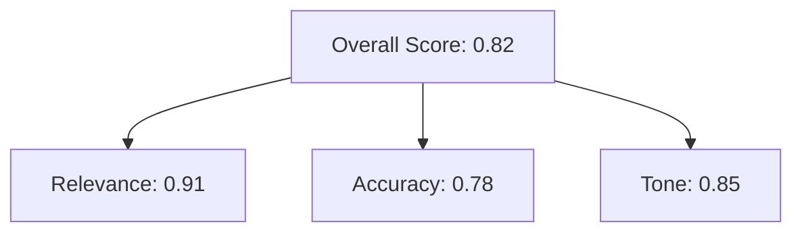
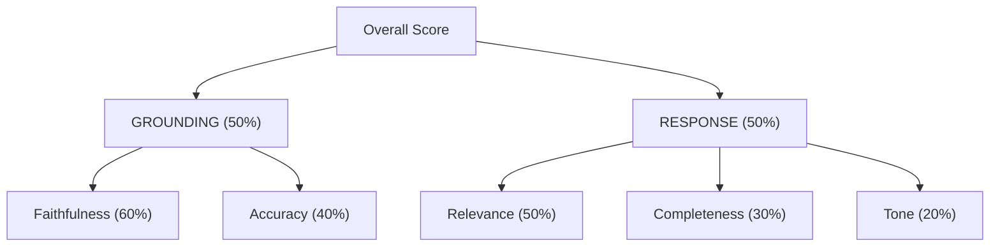

# Hierarchical Scoring

Axion's hierarchical scoring framework moves beyond flat metrics to provide a diagnostic map of AI quality—from a single overall score down into layered, weighted dimensions.

## Why Hierarchical Scoring?

Traditional evaluation gives you a single number. That's not enough.

When an AI agent scores 0.72, what does that mean? Is it struggling with relevance? Accuracy? Tone? Without structure, you're left guessing.

**Hierarchical scoring solves this by:**

- Breaking quality into meaningful dimensions
- Weighting each dimension to reflect business priorities
- Enabling drill-down from overall score to root cause



## Key Advantages

<div class="rule-grid" markdown="0">
<div class="rule-card">
<span class="rule-card__number">&#x2713;</span>
<p class="rule-card__title">Instant Root Cause Diagnosis</p>
<p class="rule-card__desc">Drill down to pinpoint whether issues stem from relevance, accuracy, tone, or other dimensions.</p>
</div>
<div class="rule-card">
<span class="rule-card__number">&#x2713;</span>
<p class="rule-card__title">Strategic Prioritization</p>
<p class="rule-card__desc">Forces clarity on what matters &mdash; break quality into layers that reflect business value.</p>
</div>
<div class="rule-card">
<span class="rule-card__number">&#x2713;</span>
<p class="rule-card__title">Actionable Feedback Loop</p>
<p class="rule-card__desc">Each layer maps to specific actions: retraining, prompt adjustments, alignment tuning.</p>
</div>
<div class="rule-card">
<span class="rule-card__number">&#x2713;</span>
<p class="rule-card__title">Customizable to Business Goals</p>
<p class="rule-card__desc">Weight dimensions to match your KPIs &mdash; define what "good AI" means for you.</p>
</div>
</div>

## Quick Start

```python
from axion.runners import evaluation_runner
from axion.metrics import AnswerRelevancy, Faithfulness, FactualAccuracy
from axion.dataset import DatasetItem

# Define your scoring hierarchy
config = {
    'metric': {
        'Relevance': AnswerRelevancy(metric_name='Relevancy'),
        'Faithfulness': Faithfulness(),
        'Accuracy': FactualAccuracy(),
    },
    'model': {
        'ANSWER_QUALITY': {
            'Relevance': 0.4,
            'Faithfulness': 0.3,
            'Accuracy': 0.3,
        },
    },
    'weights': {
        'ANSWER_QUALITY': 1.0,
    }
}

# Create evaluation data
data_item = DatasetItem(
    query="How do I reset my password?",
    actual_output="To reset your password, click 'Forgot Password' on the login page and follow the email instructions.",
    expected_output="Click 'Forgot Password' on the login page, enter your email, and follow the reset link sent to your inbox.",
    retrieved_content=["Password reset is available via the login page. Users receive a reset link by email."]
)

# Run hierarchical evaluation
results = evaluation_runner(
    evaluation_inputs=[data_item],
    scoring_config=config,
    evaluation_name="RAG Quality Evaluation"
)

# View results
results.to_dataframe()

# Generate visual scorecard
results.to_scorecard()
```

## Configuration Options

### Option 1: Python Dictionary

Define your hierarchy directly in code:

```python
config = {
    'metric': {
        'Relevance': AnswerRelevancy(metric_name='Relevancy'),
        'Faithfulness': Faithfulness(),
    },
    'model': {
        'RESPONSE_QUALITY': {
            'Relevance': 0.6,
            'Faithfulness': 0.4,
        },
    },
    'weights': {
        'RESPONSE_QUALITY': 1.0,
    }
}
```

### Option 2: YAML Configuration

For version-controlled, shareable configs:

```yaml
# config.yaml
metric:
  Relevance:
    class: 'answer_relevancy'
    metric_name: 'Relevancy'
    model_name: 'gpt-4.1'
  Faithfulness:
    class: 'faithfulness'

model:
  RESPONSE_QUALITY:
    Relevance: 0.6
    Faithfulness: 0.4

weights:
  RESPONSE_QUALITY: 1.0
```

```python
# Load from file
results = evaluation_runner(
    evaluation_inputs=[data_item],
    scoring_config="config.yaml",
)
```

## Multi-Level Hierarchies

Build deeper hierarchies for complex evaluation needs:

```python
config = {
    'metric': {
        'Relevance': AnswerRelevancy(),
        'Faithfulness': Faithfulness(),
        'Accuracy': FactualAccuracy(),
        'Completeness': AnswerCompleteness(),
        'Tone': ToneConsistency(),
    },
    'model': {
        # First level: group metrics into categories
        'GROUNDING': {
            'Faithfulness': 0.6,
            'Accuracy': 0.4,
        },
        'RESPONSE': {
            'Relevance': 0.5,
            'Completeness': 0.3,
            'Tone': 0.2,
        },
    },
    'weights': {
        # Second level: weight the categories
        'GROUNDING': 0.5,
        'RESPONSE': 0.5,
    }
}
```

This produces:



## Accessing Results

```python
# Overall score
print(results.overall_score)

# Category scores
for category, score in results.category_scores.items():
    print(f"{category}: {score}")

# Individual metric scores
for metric_name, score in results.metric_scores.items():
    print(f"{metric_name}: {score}")

# Export to DataFrame for analysis
df = results.to_dataframe()

# Generate visual scorecard
results.to_scorecard()
```

## Best Practices

<div class="rule-grid" markdown="0">
<div class="rule-card">
<span class="rule-card__number">1</span>
<p class="rule-card__title">Start Simple</p>
<p class="rule-card__desc">Begin with 2-3 key dimensions. Expand as you learn what matters.</p>
</div>
<div class="rule-card">
<span class="rule-card__number">2</span>
<p class="rule-card__title">Align to Business</p>
<p class="rule-card__desc">Weights should reflect actual business priorities, not theoretical ideals.</p>
</div>
<div class="rule-card">
<span class="rule-card__number">3</span>
<p class="rule-card__title">Review Failures</p>
<p class="rule-card__desc">Low-scoring dimensions indicate where to focus improvement efforts.</p>
</div>
<div class="rule-card">
<span class="rule-card__number">4</span>
<p class="rule-card__title">Iterate & Version</p>
<p class="rule-card__desc">Refine weights based on outcomes. Use YAML configs to track scoring criteria over time.</p>
</div>
</div>

---

[Metrics Reference :octicons-arrow-right-24:](../reference/metrics.md){ .md-button .md-button--primary }
[Creating Custom Metrics :octicons-arrow-right-24:](../deep-dives/metrics/creating-metrics.md){ .md-button }
[Eval Tree API :octicons-arrow-right-24:](../reference/eval-tree.md){ .md-button }
