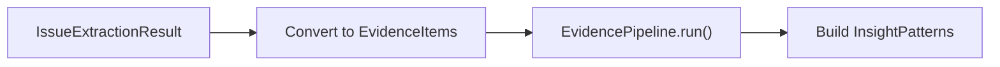

# Cross-Metric Insight Extraction

Discover cross-metric patterns from evaluation issues using semantic clustering. The `InsightExtractor` bridges the [Issue Extractor](issue-extraction.md) with the [Evidence Pipeline](../deep-dives/caliber/pattern-discovery.md) to surface insights that span multiple metrics.

## Overview

The `IssueExtractor` groups issues mechanically by metric + signal name. But real problems often cut across metrics — for example, faithfulness **and** contextual recall failures can both point to the same retrieval problem. The `InsightExtractor` uses semantic clustering to find these cross-metric patterns automatically.

<div class="rule-grid" markdown="0">
<div class="rule-card">
<span class="rule-card__number">&#x2713;</span>
<p class="rule-card__title">Cross-Metric Patterns</p>
<p class="rule-card__desc">Detects issues that span multiple metrics pointing to a shared root cause.</p>
</div>
<div class="rule-card">
<span class="rule-card__number">&#x2713;</span>
<p class="rule-card__title">Actionable Learnings</p>
<p class="rule-card__desc">Distills clusters into titled insights with recommended actions and confidence scores.</p>
</div>
<div class="rule-card">
<span class="rule-card__number">&#x2713;</span>
<p class="rule-card__title">Composable & Opt-In</p>
<p class="rule-card__desc">Purely additive &mdash; no changes to IssueExtractor or EvidencePipeline.</p>
</div>
<div class="rule-card">
<span class="rule-card__number">&#x2713;</span>
<p class="rule-card__title">Pluggable Pipeline</p>
<p class="rule-card__desc">Full control via pipeline overrides, sinks, dedupers, and clustering methods.</p>
</div>
</div>

## Quick Start

```python
from axion.reporting import IssueExtractor, InsightExtractor
from axion.runners import evaluation_runner

# 1. Run your evaluation
results = await evaluation_runner(dataset, metrics)

# 2. Extract issues
issue_extractor = IssueExtractor()
issues = issue_extractor.extract_from_evaluation(results)

# 3. Discover cross-metric patterns
insight_extractor = InsightExtractor(model_name='gpt-4o-mini')
insights = await insight_extractor.analyze(issues)

# 4. Explore results
for pattern in insights.patterns:
    label = "CROSS-METRIC" if pattern.is_cross_metric else "single-metric"
    print(f"[{label}] {pattern.category} ({pattern.count} issues)")
    print(f"  Metrics: {', '.join(pattern.metrics_involved)}")
    print(f"  Test cases: {pattern.distinct_test_cases}")

for learning in insights.learnings:
    print(f"\n{learning.title} (confidence={learning.confidence})")
    for action in learning.recommended_actions:
        print(f"  - {action}")
```

## How It Works

The `InsightExtractor` performs three steps:



1. **Convert** — Each `ExtractedIssue` is mapped to an `EvidenceItem` with reasoning-first text and structured metadata. Issues with no reasoning and no query are skipped.

2. **Cluster & Distill** — The `EvidencePipeline` clusters evidence semantically and distills each cluster into learning artifacts with recommended actions.

3. **Enrich** — Each cluster is enriched with cross-metric metadata: which metrics are involved, whether it spans multiple metrics, and how many distinct test cases it covers.

### Issue-to-Evidence Mapping

Each issue is converted to an `EvidenceItem` for clustering:

| Issue Field | Maps To | Purpose |
|-------------|---------|---------|
| `reasoning` + `signal cue` + `query` | `EvidenceItem.text` | Clustering input |
| `test_case_id` | `source_ref` | Recurrence grouping |
| `metric_name`, `signal_name`, `value`, `score` | `metadata` | Cross-metric analysis |
| SHA-256 of key fields | `id` | Stable, deterministic IDs |

The text is structured reasoning-first for better clustering:

```
The claim contradicts the provided context about system requirements.
[faithfulness / faithfulness_verdict: CONTRADICTORY]
Query: What Python versions are supported?
```

Issues with **no reasoning and no query** produce no meaningful text and are automatically filtered out.

## Configuration

### Basic Options

```python
insight_extractor = InsightExtractor(
    model_name='gpt-4o-mini',       # LLM for clustering + distillation
    method=ClusteringMethod.LLM,     # LLM, BERTOPIC, or HYBRID
    recurrence_threshold=2,          # min unique test cases per learning
    max_items=50,                    # max evidence items to process
    min_category_size=2,             # min items per cluster
)
```

### Clustering Methods

| Method | Best for | LLM calls |
|--------|----------|-----------|
| `ClusteringMethod.LLM` | Small-medium issue sets, best label quality | Yes |
| `ClusteringMethod.BERTOPIC` | Large issue sets, cost-sensitive | No (clustering only) |
| `ClusteringMethod.HYBRID` | Large sets where you want readable labels | Partial |

```python
from axion.caliber.pattern_discovery.models import ClusteringMethod

# Cost-effective for large evaluations
extractor = InsightExtractor(
    model_name='gpt-4o-mini',
    method=ClusteringMethod.BERTOPIC,
)
```

### Custom Pipeline

For full control, pass a pre-configured `EvidencePipeline`:

```python
from axion.caliber.pattern_discovery import EvidencePipeline, InMemorySink

sink = InMemorySink()
pipeline = EvidencePipeline(
    model_name='gpt-4o-mini',
    recurrence_threshold=2,
    min_category_size=2,
    domain_context='RAG system evaluation',
    sink=sink,
)

extractor = InsightExtractor(pipeline=pipeline)
insights = await extractor.analyze(issues)

# Access persisted artifacts
for sid, entry in sink.artifacts.items():
    print(entry['artifact'].title)
```

!!! warning "No mixing"
    Passing both `pipeline=` and additional keyword arguments raises a `ValueError`. Use one or the other.

### Forwarding Pipeline Options

Any extra keyword arguments are forwarded to `EvidencePipeline`:

```python
extractor = InsightExtractor(
    model_name='gpt-4o-mini',
    seed=42,                          # reproducible sampling
    max_concurrent_distillations=3,   # limit parallel LLM calls
)
```

## Working with Results

### InsightResult

```python
insights = await extractor.analyze(issues)

insights.patterns              # List[InsightPattern] — discovered clusters
insights.learnings             # List[LearningArtifact] — distilled insights
insights.total_issues_analyzed # how many issues had meaningful text
insights.clustering_method     # the ClusteringMethod enum used
insights.pipeline_result       # full PipelineResult for advanced use
```

### InsightPattern

Each pattern represents a discovered cluster:

```python
for pattern in insights.patterns:
    print(pattern.category)          # "Retrieval Coverage Gaps"
    print(pattern.description)       # "Issues where context doesn't cover..."
    print(pattern.count)             # 8
    print(pattern.metrics_involved)  # ['faithfulness', 'contextual_recall']
    print(pattern.is_cross_metric)   # True
    print(pattern.distinct_test_cases)  # 5
    print(pattern.examples)          # excerpted evidence text
    print(pattern.confidence)        # 0.85
```

The `is_cross_metric` flag is `True` when a cluster contains issues from 2 or more different metrics — the key signal that a shared root cause exists.

### LearningArtifact

Each learning is a structured, actionable insight:

```python
for learning in insights.learnings:
    print(learning.title)              # "Mobile Checkout Failures on iOS"
    print(learning.content)            # detailed explanation
    print(learning.confidence)         # 0.9
    print(learning.tags)               # ['retrieval', 'context_quality']
    print(learning.recommended_actions)  # ['Improve chunk overlap...']
    print(learning.supporting_item_ids)  # evidence IDs backing this
```

## Sync Usage

For non-async code:

```python
insights = extractor.analyze_sync(issues)
```

## Complete Example

```python
import asyncio
from axion import Dataset
from axion.metrics import Faithfulness, AnswerRelevancy, ContextualRecall
from axion.runners import evaluation_runner
from axion.reporting import IssueExtractor, InsightExtractor

async def discover_patterns():
    # 1. Run evaluation
    dataset = Dataset.from_csv('test_cases.csv')
    results = await evaluation_runner(
        dataset=dataset,
        metrics=[Faithfulness(), AnswerRelevancy(), ContextualRecall()],
    )

    # 2. Extract issues
    issue_extractor = IssueExtractor(score_threshold=0.0)
    issues = issue_extractor.extract_from_evaluation(results)
    print(f'Found {issues.issues_found} issues across {issues.total_test_cases} test cases')

    if issues.issues_found == 0:
        print('No issues found.')
        return

    # 3. Discover cross-metric patterns
    insight_extractor = InsightExtractor(
        model_name='gpt-4o-mini',
        recurrence_threshold=2,
    )
    insights = await insight_extractor.analyze(issues)

    # 4. Report cross-metric patterns
    cross_metric = [p for p in insights.patterns if p.is_cross_metric]
    print(f'\n--- {len(cross_metric)} cross-metric patterns found ---')
    for pattern in cross_metric:
        print(f'\n{pattern.category} ({pattern.count} issues)')
        print(f'  Metrics: {", ".join(pattern.metrics_involved)}')
        print(f'  Distinct test cases: {pattern.distinct_test_cases}')

    # 5. Show actionable learnings
    print(f'\n--- {len(insights.learnings)} learnings ---')
    for learning in insights.learnings:
        print(f'\n{learning.title} (confidence={learning.confidence})')
        print(f'  {learning.content[:200]}')
        for action in learning.recommended_actions:
            print(f'  -> {action}')

asyncio.run(discover_patterns())
```

## Relationship to Other Tools

| Tool | What it does | When to use |
|------|-------------|-------------|
| [`IssueExtractor`](issue-extraction.md) | Extracts failing signals by metric + signal | Always — it produces the input for `InsightExtractor` |
| [`InsightExtractor`](#) | Clusters issues semantically across metrics | When you want cross-metric root cause analysis |
| [`EvidencePipeline`](../deep-dives/caliber/pattern-discovery.md) | General-purpose evidence clustering + distillation | When you have arbitrary text evidence (not evaluation issues) |

The `InsightExtractor` is the bridge: it converts `IssueExtractor` output into `EvidenceItem` format and runs it through the `EvidencePipeline`.

## API Reference

See the full [Insight Extractor API Reference](../reference/insight-extractor.md) for class signatures and data class details.
