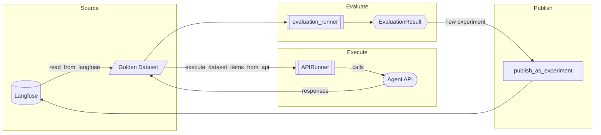
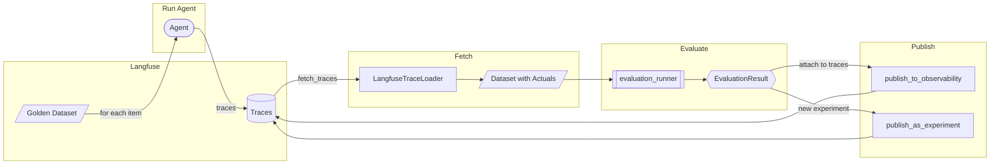
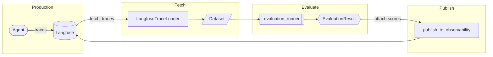
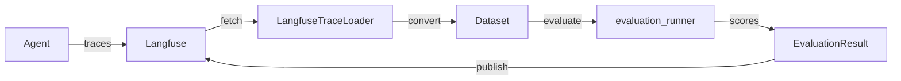

# Langfuse Integration

Integrate Axion evaluation with Langfuse observability to close the feedback loop between production LLM operations and quality metrics.

## Why Use Langfuse with Axion?

- **Close the feedback loop**: Connect evaluation results directly to production traces
- **Production-grade observability**: Track LLM performance, costs, and quality metrics in one place
- **Continuous evaluation**: Automate evaluation pipelines on real production data

---

## Evaluation Workflows

Axion supports three distinct evaluation workflows, each designed for different use cases. Understanding when to use each workflow is critical for effective LLM evaluation.

### Workflow Overview

| Workflow | Testing Style | Primary Use Case | Publishing Method |
|----------|--------------|------------------|-------------------|
| **[API-Driven](#offline-api-driven)** | Black-box | Regression testing, CI/CD | `publish_as_experiment()` |
| **[Trace-Based](#offline-trace-based)** | White-box | Historical analysis, debugging | `publish_as_experiment()` or `publish_to_observability()` |
| **[Online Production](#online-production)** | Continuous | Real-time quality monitoring | `publish_to_observability()` |

---

### Offline: API-Driven

**Best for:** Regression testing, CI/CD pipelines, comparing API versions

This workflow treats your agent as a black-box. You provide inputs from a golden dataset, call your API endpoint, and evaluate the responses. You don't need access to internal traces or spans.



**When to use:**

- You want to test API behavior without trace instrumentation
- Running automated regression tests in CI/CD
- Comparing responses between different API versions or models
- The agent is deployed as a service and you only care about input/output behavior

**Example:**

```python
from axion import Dataset
from axion.metrics import AnswerRelevancy, Faithfulness
from axion.runners import evaluation_runner

# 1. Load golden dataset from Langfuse
dataset = Dataset.read_from_langfuse(golden, name='my_eval_dataset')

# 2. Execute API calls to populate actual_output
dataset.execute_dataset_items_from_api('Agent API', 'config.yaml')

# 3. Run evaluation
result = await evaluation_runner(
    evaluation_inputs=dataset,
    scoring_metrics=[AnswerRelevancy(), Faithfulness()],
    evaluation_name='API Regression Test',
)

# 4. Publish as experiment for version comparison
result.publish_as_experiment(
    dataset_name='api-regression-tests',
    run_name='v2.1-release',
)
```

---

### Offline: Trace-Based

**Best for:** Historical analysis, A/B experiments, debugging with span-level insights

This workflow evaluates agent runs where you have access to internal traces. You trigger agent runs from a golden dataset, collect the traces (with span-level details), then evaluate. This gives you white-box visibility into agent internals.



**When to use:**

- You need span-level insights (LLM calls, tool usage, retrieval steps)
- Debugging why specific responses failed
- Running A/B experiments with different agent configurations
- Evaluating historical production runs

**Key difference from API-Driven:** The `actual_output` is extracted from traces, giving you access to intermediate steps, not just final responses.

**Example:**

```python
from axion._core.tracing.loaders import LangfuseTraceLoader
from axion.metrics import AnswerRelevancy, Faithfulness
from axion.runners import evaluation_runner
from axion import Dataset, DatasetItem

# 1. Run your agent against golden dataset items (externally)
# This creates traces in Langfuse with tags ['experiment-v1']

# 2. Fetch traces with outputs
loader = LangfuseTraceLoader()
traces = loader.fetch_traces(tags=['experiment-v1'])

# 3. Convert to Dataset (preserving trace_id for linking)
items = [
    DatasetItem(
        id=t.id,
        query=t.input.get('query', ''),
        actual_output=t.output.get('response', ''),
        trace_id=t.id,  # Preserves link to original trace
    )
    for t in traces if t.input and t.output
]
dataset = Dataset(items=items)

# 4. Run evaluation
result = await evaluation_runner(
    evaluation_inputs=dataset,
    scoring_metrics=[AnswerRelevancy(), Faithfulness()],
    evaluation_name='Trace-Based Evaluation',
)

# 5. Publish - choose based on your needs:
# Option A: Attach scores to existing traces (for debugging)
result.publish_to_observability()

# Option B: Create experiment (for comparison UI)
result.publish_as_experiment(
    dataset_name='agent-experiments',
    run_name='config-v2',
    link_to_traces=True,  # Links experiment runs to original traces
)
```

---

### Online: Production

**Best for:** Continuous quality monitoring, real-time alerts, production health tracking

This workflow evaluates live production traces. You fetch recent traces from Langfuse, run evaluation metrics, and attach scores back to those traces for monitoring dashboards.



**When to use:**

- Monitoring production quality in real-time
- Setting up quality alerts and dashboards
- Tracking quality drift over time
- Evaluating a sample of production traffic

**Example:**

```python
from axion._core.tracing.loaders import LangfuseTraceLoader
from axion.metrics import AnswerRelevancy, Toxicity
from axion.runners import evaluation_runner
from axion import Dataset, DatasetItem

async def evaluate_production_traces():
    # 1. Fetch recent production traces
    loader = LangfuseTraceLoader()
    traces = loader.fetch_traces(
        limit=100,
        tags=['production'],
    )

    # 2. Convert to Dataset
    items = [
        DatasetItem(
            id=t.id,
            query=t.input.get('query', ''),
            actual_output=t.output.get('response', ''),
            trace_id=t.id,
        )
        for t in traces if t.input and t.output
    ]
    dataset = Dataset(items=items)

    # 3. Run lightweight evaluation metrics
    result = await evaluation_runner(
        evaluation_inputs=dataset,
        scoring_metrics=[AnswerRelevancy(), Toxicity()],
        evaluation_name='Production Monitoring',
    )

    # 4. Attach scores to production traces
    stats = result.publish_to_observability(tags=['automated-eval'])
    print(f"Evaluated {stats['uploaded']} production traces")

# Run periodically (e.g., every hour via cron)
```

!!! tip "Cost Considerations for Online Evaluation"
    For high-volume production systems, consider:

    - **Sampling**: Evaluate a random sample (e.g., 1-5%) of traces instead of all
    - **Lightweight metrics**: Use heuristic metrics instead of LLM-based metrics for high-frequency evaluation
    - **Batching**: Aggregate traces and evaluate in batches during off-peak hours

---

### Disabling Evaluation Tracing

By default, `evaluation_runner` creates traces for each metric execution. If you don't need these evaluation traces (most publishing workflows only use **source traces** from `DatasetItem.trace_id`), you can disable them to reduce overhead.

**Important:** Configure tracing to NOOP *before* creating metric instances, since tracers are cached at instantiation time.

```python
from axion.tracing import configure_tracing
from axion.runners import evaluation_runner
from axion.metrics import AnswerRelevancy, ExactStringMatch

# 1. Disable tracing BEFORE creating metrics
configure_tracing('noop')

# 2. Create metrics (they will use NOOP tracers)
config = {
    'metric': {
        'Relevance': AnswerRelevancy(model_name='gpt-4o'),
        'ExactStringMatch': ExactStringMatch(),
    },
    'model': {
        'ANSWER_QUALITY': {
            'Relevance': 1.0,
            'ExactStringMatch': 1.0,
        },
    },
    'weights': {
        'ANSWER_QUALITY': 1.0,
    }
}

# 3. Run evaluation (no evaluation traces created)
results = evaluation_runner(
    evaluation_inputs=dataset,
    scoring_config=config,
    evaluation_name='My Evaluation',
)

# 4. Restore tracing for publishing
configure_tracing('langfuse')

# 5. Publish results (uses source traces from DatasetItem.trace_id)
results.publish_to_observability()
```

!!! note "When to keep evaluation tracing enabled"
    Keep tracing enabled (default) when:

    - Using `publish_as_experiment(score_on_runtime_traces=True)`
    - You need to debug metric execution in Langfuse
    - You want visibility into LLM calls made by metrics

---

### Choosing the Right Workflow

Use this decision tree to select the appropriate workflow:

```
Do you have existing traces in Langfuse?
├── No → Do you need span-level insights?
│         ├── No → Use API-Driven (black-box testing)
│         └── Yes → Run agent with tracing, then use Trace-Based
└── Yes → Are these production traces?
          ├── Yes → Use Online Production (monitoring)
          └── No → Use Trace-Based (historical analysis)
```

| Question | API-Driven | Trace-Based | Online |
|----------|:----------:|:-----------:|:------:|
| Need span-level debugging? | No | Yes | Depends |
| Requires trace instrumentation? | No | Yes | Yes |
| Creates new traces? | Optional | Yes | No |
| Best for CI/CD? | Yes | Possible | No |
| Best for monitoring? | No | No | Yes |

---

## Quick Summary



??? note "Detailed Workflow"

    ```mermaid
    flowchart LR
        subgraph Production["Production"]
            direction TB
            A([Agent]) -->|traces| B[(Langfuse)]
        end

        subgraph Fetch["Fetch"]
            direction TB
            B -->|fetch_traces| C[LangfuseTraceLoader]
            C --> D[/Dataset/]
            E[/Local Data/] --> D
        end

        subgraph Evaluate["Evaluate"]
            direction TB
            D --> F[[evaluation_runner]]
            F --> G{{EvaluationResult}}
        end

        subgraph Analyze["Analyze"]
            direction TB
            G --> H[summary]
            G --> I[to_dataframe]
            G --> J[to_scorecard]
        end

        subgraph Publish["Publish"]
            direction TB
            G -->|existing traces| K[publish_to_observability]
            G -->|new experiment| L[publish_as_experiment]
            K --> B
            L --> B
        end
    ```

## Complete Example

This example demonstrates the full workflow: fetching traces, running evaluation, viewing results, and publishing back to Langfuse.

```python
import asyncio
from axion._core.tracing.loaders import LangfuseTraceLoader
from axion.metrics import AnswerRelevancy, AnswerCompleteness
from axion.runners import evaluation_runner
from axion import Dataset, DatasetItem

async def main():
    # 1. Fetch traces from Langfuse
    loader = LangfuseTraceLoader()
    traces = loader.fetch_traces(limit=50, tags=['production'])

    # 2. Convert to Dataset
    items = [
        DatasetItem(
            id=t.id,
            query=t.input.get('query', ''),
            actual_output=t.output.get('response', ''),
            trace_id=t.id,
        )
        for t in traces if t.input and t.output
    ]
    dataset = Dataset(items=items)

    # 3. Run evaluation
    result = await evaluation_runner(
        evaluation_inputs=dataset,
        scoring_metrics=[AnswerRelevancy(), AnswerCompleteness()],
        evaluation_name='Production Evaluation',
    )

    # 4. View results
    print(result.summary())
    result.to_scorecard(display_in_notebook=True)

    # 5. Publish back to Langfuse
    stats = result.publish_as_experiment(
        dataset_name='my-eval-dataset',
        run_name='experiment-v1',
        tags=['production']
    )
    print(f"Published {stats['scores_uploaded']} scores")

asyncio.run(main())
```

## Understanding Results

After running `evaluation_runner`, use these methods to analyze results:

| Method | Description |
|--------|-------------|
| `result.summary()` | Print aggregate statistics for all metrics |
| `result.to_dataframe()` | Convert results to a pandas DataFrame for analysis |
| `result.to_scorecard(display_in_notebook=True)` | Display an interactive scorecard visualization |
| `result.to_latency_plot()` | Visualize metric latency distributions |

### Quick Analysis

```python
# Get summary statistics
print(result.summary())

# Export to DataFrame for custom analysis
df = result.to_dataframe()
print(df.describe())

# Visual scorecard (in Jupyter notebooks)
result.to_scorecard(display_in_notebook=True)
```

## Workflow Steps

1. **[Configure Langfuse](configuration.md)**: Set up credentials and environment
2. **[Create Traces](tracing.md)**: Instrument your LLM operations with `@trace` decorator
3. **Fetch & Evaluate**: Retrieve traces and run metrics
4. **[Publish Results](publishing.md)**: Send scores back to Langfuse

## Next Steps

- **[Configuration](configuration.md)**: Set up Langfuse credentials and options
- **[Tracing](tracing.md)**: Learn how to create and manage traces
- **[Publishing](publishing.md)**: Publish scores to existing traces or create experiments
- **[Metrics Guide](../metrics.md)**: Available metrics and customization options
