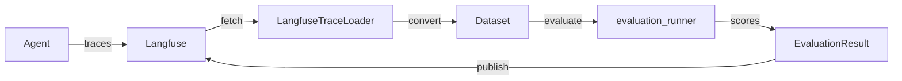

# Langfuse Integration

Integrate Axion evaluation with Langfuse observability to close the feedback loop between production LLM operations and quality metrics.

## Why Use Langfuse with Axion?

- **Close the feedback loop**: Connect evaluation results directly to production traces
- **Production-grade observability**: Track LLM performance, costs, and quality metrics in one place
- **Continuous evaluation**: Automate evaluation pipelines on real production data

## Quick Summary



??? note "Detailed Workflow"

    ```mermaid
    flowchart LR
        subgraph Production["Production"]
            direction TB
            A([Agent]) -->|traces| B[(Langfuse)]
        end

        subgraph Fetch["Fetch"]
            direction TB
            B -->|fetch_traces| C[LangfuseTraceLoader]
            C --> D[/Dataset/]
            E[/Local Data/] --> D
        end

        subgraph Evaluate["Evaluate"]
            direction TB
            D --> F[[evaluation_runner]]
            F --> G{{EvaluationResult}}
        end

        subgraph Analyze["Analyze"]
            direction TB
            G --> H[summary]
            G --> I[to_dataframe]
            G --> J[to_scorecard]
        end

        subgraph Publish["Publish"]
            direction TB
            G -->|existing traces| K[publish_to_observability]
            G -->|new experiment| L[publish_as_experiment]
            K --> B
            L --> B
        end
    ```

??? note "API Runner Driven Workflow"

    Use this workflow when you have a golden dataset in Langfuse and want to test your Agent API against it.

    ```python
    dataset = Dataset.read_from_langfuse(golden, name='my_eval_dataset')
    dataset.execute_dataset_items_from_api('Agent API', 'config.yaml')
    ```

    ```mermaid
    flowchart LR
        subgraph Source["Source"]
            direction TB
            A[(Langfuse)] -->|read_from_langfuse| B[/Golden Dataset/]
        end

        subgraph Execute["Execute"]
            direction TB
            B -->|execute_dataset_items_from_api| C[[APIRunner]]
            C -->|calls| D([Agent API])
            D -->|responses| B
        end

        subgraph Evaluate["Evaluate"]
            direction TB
            B --> E[[evaluation_runner]]
            E --> F{{EvaluationResult}}
        end

        subgraph Analyze["Analyze"]
            direction TB
            F --> G[summary]
            F --> H[to_dataframe]
            F --> I[to_scorecard]
        end

        subgraph Publish["Publish"]
            direction TB
            F -->|new experiment| J[publish_as_experiment]
            J --> A
        end
    ```

??? note "Offline Eval Workflow"

    Use this workflow for offline evaluation with human-annotated golden datasets. The agent runs are triggered from the dataset, traces are collected, then evaluated.

    ```mermaid
    flowchart LR
        subgraph LF["Langfuse"]
            direction TB
            A[/Human Annotated\nGolden Dataset/]
            C[(Traces)]
        end

        subgraph Run["Run Agent"]
            direction TB
            B([Agent])
        end

        subgraph Fetch["Fetch"]
            direction TB
            D[LangfuseTraceLoader]
            E[/Dataset with\nActual Outputs/]
            D --> E
        end

        subgraph Evaluate["Evaluate"]
            direction TB
            F[[evaluation_runner]]
            G{{EvaluationResult}}
            F --> G
        end

        subgraph Analyze["Analyze"]
            direction TB
            H[summary]
            I[to_dataframe]
            J[to_scorecard]
        end

        subgraph Publish["Publish"]
            direction TB
            K[publish_to_observability]
            L[publish_as_experiment]
        end

        A -->|for each item| B
        B -->|traces| C
        C -->|fetch_traces| D
        E --> F
        G --> H
        G --> I
        G --> J
        G -->|attach to traces| K
        G -->|new experiment| L
        K --> C
        L --> C
    ```

## Complete Example

This example demonstrates the full workflow: fetching traces, running evaluation, viewing results, and publishing back to Langfuse.

```python
import asyncio
from axion._core.tracing.loaders import LangfuseTraceLoader
from axion.metrics import AnswerRelevancy, Faithfulness
from axion.runners import evaluation_runner
from axion import Dataset, DatasetItem

async def main():
    # 1. Fetch traces from Langfuse
    loader = LangfuseTraceLoader()
    traces = loader.fetch_traces(limit=50, tags=['production'])

    # 2. Convert to Dataset
    items = [
        DatasetItem(
            id=t.id,
            query=t.input.get('query', ''),
            actual_output=t.output.get('response', ''),
            trace_id=t.id,
        )
        for t in traces if t.input and t.output
    ]
    dataset = Dataset(items=items)

    # 3. Run evaluation
    result = await evaluation_runner(
        evaluation_inputs=dataset,
        scoring_metrics=[AnswerRelevancy(), Faithfulness()],
        evaluation_name='Production Evaluation',
    )

    # 4. View results
    print(result.summary())
    result.to_scorecard(display_in_notebook=True)

    # 5. Publish back to Langfuse
    stats = result.publish_as_experiment(
        dataset_name='my-eval-dataset',
        run_name='experiment-v1',
        tags=['production']
    )
    print(f"Published {stats['scores_uploaded']} scores")

asyncio.run(main())
```

## Understanding Results

After running `evaluation_runner`, use these methods to analyze results:

| Method | Description |
|--------|-------------|
| `result.summary()` | Print aggregate statistics for all metrics |
| `result.to_dataframe()` | Convert results to a pandas DataFrame for analysis |
| `result.to_scorecard(display_in_notebook=True)` | Display an interactive scorecard visualization |
| `result.to_latency_plot()` | Visualize metric latency distributions |

### Quick Analysis

```python
# Get summary statistics
print(result.summary())

# Export to DataFrame for custom analysis
df = result.to_dataframe()
print(df.describe())

# Visual scorecard (in Jupyter notebooks)
result.to_scorecard(display_in_notebook=True)
```

## Workflow Steps

1. **[Configure Langfuse](configuration.md)**: Set up credentials and environment
2. **[Create Traces](tracing.md)**: Instrument your LLM operations with `@trace` decorator
3. **Fetch & Evaluate**: Retrieve traces and run metrics
4. **[Publish Results](publishing.md)**: Send scores back to Langfuse

## Next Steps

- **[Configuration](configuration.md)**: Set up Langfuse credentials and options
- **[Tracing](tracing.md)**: Learn how to create and manage traces
- **[Publishing](publishing.md)**: Publish scores to existing traces or create experiments
- **[Metrics Guide](../metrics.md)**: Available metrics and customization options
