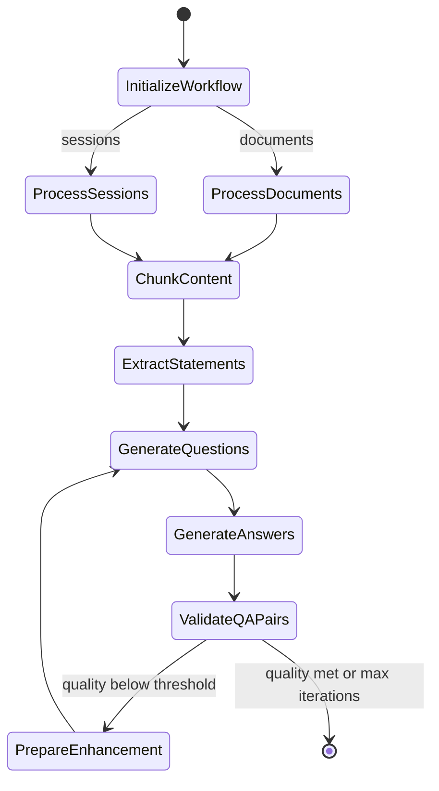

# Synthetic Data Generation

Generate evaluation datasets from documents or sessions to scale your test coverage.

## Overview

Manual dataset curation is essential but doesn't scale. Axion provides synthetic generation methods powered by a graph-based workflow built on `pydantic_graph`:

1. **Document Q&A Generation** - Create question-answer pairs from your knowledge base
2. **Session-based Generation** - Generate Q&A from conversation transcripts

## Generation Methods

=== ":material-file-document: Document Q&A"

    Generate evaluation data from your documents using `DocumentQAGenerator`:

    ```python
    from axion.synthetic import DocumentQAGenerator, GenerationParams

    # Initialize with your LLM
    generator = DocumentQAGenerator(
        llm=your_llm,  # LLMRunnable-compatible object
        params=GenerationParams(
            num_pairs=10,
            question_types=["factual", "conceptual", "application"],
            difficulty="medium",
            answer_length="medium",
            validation_threshold=0.7,
        ),
    )

    # Generate from a directory of documents
    results = await generator.generate_from_directory("./documents")

    # Convert to Dataset for evaluation
    dataset = generator.to_dataset(results, dataset_name="my_synthetic_dataset")
    ```

    **Direct Workflow Usage**

    For more control, use `QAWorkflowGraph` directly:

    ```python
    from axion.synthetic.workflow import QAWorkflowGraph

    workflow = QAWorkflowGraph(llm=your_llm)

    # Run with document content
    result = await workflow.run_from_documents(
        content="Your document text here...",
        num_pairs=5,
        question_types=["factual", "analytical"],
        difficulty="medium",
        splitter_type="sentence",
        chunk_size=2048,
        statements_per_chunk=5,
        validation_threshold=0.8,
        max_reflection_iterations=3,
    )

    # Access results
    qa_pairs = result["validated_qa_pairs"]
    statements = result["statements"]
    quality = result["average_quality"]
    ```

=== ":material-forum: Session-based"

    Generate Q&A pairs from conversation transcripts:

    ```python
    from axion.synthetic.workflow import QAWorkflowGraph

    workflow = QAWorkflowGraph(llm=your_llm)

    result = await workflow.run_from_sessions(
        session_messages=[
            {"role": "user", "content": "How do I reset my password?"},
            {"role": "assistant", "content": "Go to Settings > Security > Reset Password"},
        ],
        session_metadata={"topic": "account_management"},
        num_pairs=3,
    )
    ```

## How It Works

The workflow is implemented as a directed graph with the following nodes:



### Pipeline Steps

| Step | Description |
|------|-------------|
| **Initialize** | Validate inputs and configure processors |
| **Process** | Apply transformations to documents or sessions |
| **Chunk** | Split content using sentence or semantic chunking |
| **Extract Statements** | Parse content into factual claims with source indices |
| **Generate Questions** | Create diverse questions from statements |
| **Generate Answers** | Create ground-truth answers from source content |
| **Validate** | Score Q&A pairs and filter low-quality results |
| **Enhance** | Iteratively improve questions below threshold |

## Configuration Options

### GenerationParams

| Parameter | Type | Default | Description |
|-----------|------|---------|-------------|
| `num_pairs` | int | 1 | Number of Q&A pairs to generate |
| `question_types` | list | factual, conceptual, application, analysis | Types of questions to generate |
| `difficulty` | str | medium | Question difficulty (easy, medium, hard) |
| `splitter_type` | str | semantic | Chunking strategy (semantic, sentence) |
| `chunk_size` | int | 4000 | Max chunk size for sentence splitter |
| `statements_per_chunk` | int | 5 | Statements to extract per chunk |
| `answer_length` | str | medium | Answer length (short, medium, long) |
| `validation_threshold` | float | 0.7 | Minimum quality score to accept |
| `max_reflection_iterations` | int | 3 | Max enhancement iterations |
| `custom_guidelines` | str | None | Custom instructions for generation |
| `example_question` | str | None | Example question for style guidance |
| `example_answer` | str | None | Example answer for style guidance |

### Dimensional Generation

Guide generation with structured dimensions:

```python
result = await workflow.run_from_documents(
    content=content,
    num_pairs=10,
    dimensions={
        "features": "Product pricing, subscription tiers, enterprise features",
        "persona": "Technical decision maker evaluating SaaS solutions",
        "scenarios": "Comparing vendor options during procurement process",
    },
)
```

## Key Considerations

!!! warning "Quality Over Quantity"
    Synthetic data quality varies significantly. Always review a sample before using at scale, and use `validation_threshold` to filter aggressively.

### Iterative Refinement

The workflow automatically refines low-quality Q&A pairs:

```python
result = await workflow.run_from_documents(
    content=content,
    validation_threshold=0.85,  # High bar
    max_reflection_iterations=5,  # More attempts to meet threshold
)

print(f"Final quality: {result['average_quality']:.2f}")
print(f"Iterations used: {result['current_iteration']}")
```

### Coverage Strategy

| Phase | Focus |
|-------|-------|
| **Formation** | Curate real-world examples with expert validation |
| **Expansion** | Augment with synthetic data for edge cases |
| **Maintenance** | Continuously add new failure modes |

## When to Use Synthetic Data

**Good for:**

- Expanding coverage of edge cases
- Testing rare scenarios
- Scaling regression testing
- Bootstrapping evaluation datasets

**Not a replacement for:**

- Real user data
- Expert-labeled ground truth
- Domain-specific nuance

## Graph Visualization

View the workflow structure in notebooks:

```python
workflow = QAWorkflowGraph(llm=your_llm)
workflow.visualize_graph()  # Displays mermaid diagram
```

---

<div class="ref-nav" markdown="1">

[Agent Evaluation Playbook :octicons-arrow-right-24:](../agent_playbook.md){ .md-button .md-button--primary }
[Metrics Guide :octicons-arrow-right-24:](metrics.md){ .md-button }
[Synthetic Data Reference :octicons-arrow-right-24:](../reference/synthetic.md){ .md-button }

</div>
