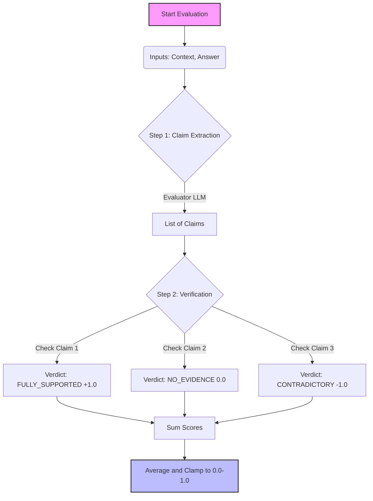

# Faithfulness

<div class="grid cards" markdown>

- ### :material-ruler: Metric
  `Faithfulness`


- ### :material-tag: Tags
  `knowledge`, `single_turn`

- ### :material-chart-bell-curve: Range
  \([0, 1]\)

</div>

## Metric Description

Faithfulness measures the factual consistency of the generated answer against the retrieved context. It determines whether the claims made in the response can be directly inferred from the provided source material.

- **Score 1.0 (High):** Every claim in the response is fully supported by the context.
- **Score 0.0 (Low):** The response contains hallucinations, unsupported claims, or contradictions.


## How It Is Computed

The computation uses an Evaluator LLM to extract atomic claims and verify them against the retrieved context. Your implementation uses a weighted verdict system rather than a simple binary pass/fail.

### Scoring Logic

Each extracted claim is assigned a verdict and a corresponding weight. These defaults can be overridden via `verdict_scores`.

| Verdict | Weight | Description |
|---------|--------|-------------|
| `FULLY_SUPPORTED` | 1.0 | The claim is explicitly found in the context. |
| `PARTIALLY_SUPPORTED` | 0.5 | The claim is implied or partially found. |
| `NO_EVIDENCE` | 0.0 | The claim is not found (Hallucination). (-1.0 in strict mode) |
| `CONTRADICTORY` | -1.0 | The claim directly contradicts the context. |

<details markdown="1">
<summary><strong>Computation Workflow</strong></summary>



</details>

## Configuration Options

The metric supports several configuration parameters found in `faithfulness.py`:

- `strict_mode` (bool): If `True`, claims with `NO_EVIDENCE` are penalized with a score of -1.0 (same as contradictory), drastically lowering the score for hallucinations.
- `verdict_scores` (dict): Custom override for weights (e.g., `{ "CONTRADICTORY": -2.0 }`).

## Implementation Details

### Required Inputs

| Field | Type | Description |
|-------|------|-------------|
| `retrieved_content` | `List[str]` | The raw text chunks retrieved by the vector database. |
| `actual_output` | `str` | The final response generated by the LLM. |
| `query` | `str` | The user's input question. |

## Code Example

```python
from axion.metrics import Faithfulness
from axion.dataset import DatasetItem

# Initialize the metric
metric = Faithfulness()  # optional: Faithfulness(strict_mode=True)

data_item = DatasetItem(
    query="What is the infield fly rule in baseball?",
    actual_output="The infield fly rule prevents the defense from intentionally dropping a fly ball to turn a double play.",
    expected_output="The infield fly rule protects baserunners by declaring the batter out on certain easy pop-ups.",
    retrieved_content=[
        "The infield fly rule prevents unfair advantage.",
        "Applies with runners on first and second.",
    ],
    latency=2.13,
)

result = await metric.execute(data_item)
print(result.pretty())
```

<details markdown="1">
<summary><strong>Example Scenarios</strong></summary>

!!! success "Pass (1.0) - Fully Grounded"
    **Context:** "The project code name is Apollo."  
    **Answer:** "The internal project is called Apollo."  
    **Reasoning:** Verdict is `FULLY_SUPPORTED`.

!!! failure "Fail (0.0) - Contradiction"
    **Context:** "The refund window is 30 days."  
    **Answer:** "You have 60 days to return the item."  
    **Reasoning:** Verdict is `CONTRADICTORY` (-1.0), clamping final score to 0.

</details>


## Business Benefit

- **Risk Mitigation:** Acts as the primary guardrail against "hallucinations," protecting the brand from legal or reputational liability caused by invented facts.
- **User Trust:** Essential for high-stakes domains (legal, financial, medical) where users need to trust that the AI is summarizing existing data, not being creative.
- **Component Isolation:** Helps distinguish between Retrieval errors (the system found the wrong doc) and Generation errors (the system found the right doc but the LLM ignored it).