# Retrieval Metrics

<div style="border-left: 4px solid #f59e0b; padding-left: 1rem; margin-bottom: 1.5rem;">
<strong style="font-size: 1.1rem;">Evaluate information retrieval quality with standard IR metrics</strong><br>
<span class="badge" style="margin-top: 0.5rem; background: #f59e0b;">Heuristic</span>
<span class="badge" style="background: #06b6d4;">Retrieval</span>
<span class="badge" style="background: #10b981;">Multi-K</span>
</div>

## Overview

Axion provides a comprehensive suite of **Information Retrieval (IR) metrics** for evaluating search and retrieval systems. These metrics compare retrieved document rankings against ground truth relevance judgments.

| Metric | What It Measures | Use Case |
|--------|-----------------|----------|
| **[Hit Rate @ K](#hit-rate-at-k)** | Any relevant result in top K? | Quick relevance check |
| **[MRR](#mean-reciprocal-rank-mrr)** | Rank of first relevant result | First-result quality |
| **[NDCG @ K](#ndcg-at-k)** | Graded relevance with position discount | Ranking quality |
| **[Precision @ K](#precision-at-k)** | Fraction of top K that's relevant | Result purity |
| **[Recall @ K](#recall-at-k)** | Fraction of relevant docs in top K | Coverage |

!!! info "Multi-K Support"
    All @K metrics support evaluating at multiple K values simultaneously (e.g., `k=[5, 10, 20]`). This allows comparing retrieval quality at different cutoffs in a single evaluation pass.

---

## Required Inputs

All retrieval metrics require the same input structure:

| Field | Type | Description |
|-------|------|-------------|
| `actual_ranking` | `List[Dict]` | Retrieved documents in order, each with `id` key |
| `expected_reference` | `List[Dict]` | Ground truth with `id` and optional `relevance` score |

```python
from axion.dataset import DatasetItem

item = DatasetItem(
    actual_ranking=[
        {"id": "doc1"},  # Position 1
        {"id": "doc2"},  # Position 2
        {"id": "doc3"},  # Position 3
    ],
    expected_reference=[
        {"id": "doc1", "relevance": 1.0},  # Relevant
        {"id": "doc5", "relevance": 1.0},  # Relevant but not retrieved
    ],
)
```

---

## Hit Rate @ K

<div style="border-left: 4px solid #3b82f6; padding-left: 1rem; margin: 1rem 0;">
<strong>Binary check: Was ANY relevant document retrieved in the top K?</strong>
</div>

### At a Glance

<div class="grid-container">

<div class="grid-item" style="text-align: center;">
<span style="font-size: 1.5rem;">🎯</span><br>
<strong>Score Range</strong><br>
<code>0.0</code> or <code>1.0</code><br>
<small>Binary pass/fail</small>
</div>

<div class="grid-item" style="text-align: center;">
<span style="font-size: 1.5rem;">📏</span><br>
<strong>Default K</strong><br>
<code>10</code><br>
<small>Top results to check</small>
</div>

</div>

### How It Works


### Usage

```python
from axion.metrics import HitRateAtK

# Single K
metric = HitRateAtK(k=10)

# Multiple K values
metric = HitRateAtK(k=[5, 10, 20], main_k=10)

result = await metric.execute(item)
print(result.score)  # 1.0 if hit, 0.0 if miss
```

### Parameters

| Parameter | Type | Default | Description |
|-----------|------|---------|-------------|
| `k` | `int \| List[int]` | `10` | Cutoff(s) for evaluation |
| `main_k` | `int` | `max(k)` | K value used for primary score |

---

## Mean Reciprocal Rank (MRR)

<div style="border-left: 4px solid #8b5cf6; padding-left: 1rem; margin: 1rem 0;">
<strong>How early does the first relevant result appear?</strong>
</div>

### At a Glance

<div class="grid-container">

<div class="grid-item" style="text-align: center;">
<span style="font-size: 1.5rem;">🎯</span><br>
<strong>Score Range</strong><br>
<code>0.0</code> ──── <code>1.0</code><br>
<small>1/rank of first relevant</small>
</div>

<div class="grid-item" style="text-align: center;">
<span style="font-size: 1.5rem;">📏</span><br>
<strong>K-Independent</strong><br>
<small>Evaluates full ranking</small>
</div>

</div>

### How It Works

```
MRR = 1 / rank_of_first_relevant_document

Examples:
- First relevant at position 1 → MRR = 1.0
- First relevant at position 2 → MRR = 0.5
- First relevant at position 4 → MRR = 0.25
- No relevant found → MRR = 0.0
```

### Usage

```python
from axion.metrics import MeanReciprocalRank

metric = MeanReciprocalRank()

result = await metric.execute(item)
print(result.score)  # 1/rank or 0.0
print(result.signals.rank_of_first_relevant)  # e.g., 3
```

---

## NDCG @ K

<div style="border-left: 4px solid #f59e0b; padding-left: 1rem; margin: 1rem 0;">
<strong>Normalized Discounted Cumulative Gain—handles graded relevance with position discounting.</strong>
</div>

### At a Glance

<div class="grid-container">

<div class="grid-item" style="text-align: center;">
<span style="font-size: 1.5rem;">🎯</span><br>
<strong>Score Range</strong><br>
<code>0.0</code> ──── <code>1.0</code><br>
<small>Normalized ranking quality</small>
</div>

<div class="grid-item" style="text-align: center;">
<span style="font-size: 1.5rem;">📏</span><br>
<strong>Default K</strong><br>
<code>10</code><br>
<small>Top results to evaluate</small>
</div>

</div>

### How It Works



```mermaid
flowchart TD
    subgraph DCG["📊 DCG Calculation"]
        A["For each position i:"]
        B["relevance[i] / log₂(i + 1)"]
        C["Sum all values"]
    end

    subgraph IDCG["🎯 IDCG (Ideal)"]
        D["Sort by relevance desc"]
        E["Calculate DCG on ideal order"]
    end

    subgraph NDCG["📈 Final Score"]
        F["NDCG = DCG / IDCG"]
    end

    DCG --> F
    IDCG --> F

    style NDCG stroke:#f59e0b,stroke-width:2px
```

**Formula:**
```
DCG@K = Σ (rel_i / log₂(i + 1)) for i = 1 to K
NDCG@K = DCG@K / IDCG@K
```

### Usage

```python
from axion.metrics import NDCGAtK

# With graded relevance
item = DatasetItem(
    actual_ranking=[{"id": "doc1"}, {"id": "doc2"}, {"id": "doc3"}],
    expected_reference=[
        {"id": "doc1", "relevance": 3.0},  # Highly relevant
        {"id": "doc2", "relevance": 1.0},  # Marginally relevant
        {"id": "doc3", "relevance": 2.0},  # Relevant
    ],
)

metric = NDCGAtK(k=[5, 10])
result = await metric.execute(item)
print(f"NDCG@10: {result.score:.3f}")
print(f"DCG: {result.signals.results_by_k[10].dcg:.3f}")
print(f"IDCG: {result.signals.results_by_k[10].idcg:.3f}")
```

### Parameters

| Parameter | Type | Default | Description |
|-----------|------|---------|-------------|
| `k` | `int \| List[int]` | `10` | Cutoff(s) for evaluation |
| `main_k` | `int` | `max(k)` | K value used for primary score |

---

## Precision @ K

<div style="border-left: 4px solid #10b981; padding-left: 1rem; margin: 1rem 0;">
<strong>What fraction of the top K results are relevant?</strong>
</div>

### At a Glance

<div class="grid-container">

<div class="grid-item" style="text-align: center;">
<span style="font-size: 1.5rem;">🎯</span><br>
<strong>Score Range</strong><br>
<code>0.0</code> ──── <code>1.0</code><br>
<small>Relevant / Retrieved</small>
</div>

<div class="grid-item" style="text-align: center;">
<span style="font-size: 1.5rem;">📏</span><br>
<strong>Default K</strong><br>
<code>10</code><br>
<small>Top results to evaluate</small>
</div>

</div>

### How It Works

```
Precision@K = (Relevant docs in top K) / K

Examples (K=5):
- 5 relevant in top 5 → Precision = 1.0
- 3 relevant in top 5 → Precision = 0.6
- 0 relevant in top 5 → Precision = 0.0
```

### Usage

```python
from axion.metrics import PrecisionAtK

metric = PrecisionAtK(k=10)

result = await metric.execute(item)
print(f"Precision@10: {result.score:.2%}")
print(f"Hits: {result.signals.results_by_k[10].hits_in_top_k}")
```

### Parameters

| Parameter | Type | Default | Description |
|-----------|------|---------|-------------|
| `k` | `int \| List[int]` | `10` | Cutoff(s) for evaluation |
| `main_k` | `int` | `max(k)` | K value used for primary score |

---

## Recall @ K

<div style="border-left: 4px solid #ec4899; padding-left: 1rem; margin: 1rem 0;">
<strong>What fraction of ALL relevant documents appear in the top K?</strong>
</div>

### At a Glance

<div class="grid-container">

<div class="grid-item" style="text-align: center;">
<span style="font-size: 1.5rem;">🎯</span><br>
<strong>Score Range</strong><br>
<code>0.0</code> ──── <code>1.0</code><br>
<small>Found / Total Relevant</small>
</div>

<div class="grid-item" style="text-align: center;">
<span style="font-size: 1.5rem;">📏</span><br>
<strong>Default K</strong><br>
<code>10</code><br>
<small>Top results to evaluate</small>
</div>

</div>

### How It Works

```
Recall@K = (Relevant docs in top K) / (Total relevant docs)

Examples (10 total relevant):
- 10 relevant in top K → Recall = 1.0
- 5 relevant in top K → Recall = 0.5
- 0 relevant in top K → Recall = 0.0
```

### Usage

```python
from axion.metrics import RecallAtK

metric = RecallAtK(k=[5, 10, 20])

result = await metric.execute(item)
print(f"Recall@10: {result.score:.2%}")
print(f"Found: {result.signals.results_by_k[10].hits_in_top_k}")
print(f"Total relevant: {result.signals.results_by_k[10].total_relevant}")
```

### Parameters

| Parameter | Type | Default | Description |
|-----------|------|---------|-------------|
| `k` | `int \| List[int]` | `10` | Cutoff(s) for evaluation |
| `main_k` | `int` | `max(k)` | K value used for primary score |

---

## Comparison Guide

### When to Use Each Metric

| Metric | Best For | Key Question |
|--------|----------|--------------|
| **Hit Rate** | Quick sanity check | "Did we find anything relevant?" |
| **MRR** | First-result systems | "How fast do users find what they need?" |
| **NDCG** | Graded relevance | "Is the ranking order optimal?" |
| **Precision** | Result quality | "Are results mostly relevant?" |
| **Recall** | Coverage | "Did we miss relevant docs?" |

### Metric Relationships


---

## Complete Example

```python
from axion.metrics import (
    HitRateAtK,
    MeanReciprocalRank,
    NDCGAtK,
    PrecisionAtK,
    RecallAtK,
)
from axion.runners import MetricRunner
from axion.dataset import DatasetItem

# Create test item
item = DatasetItem(
    actual_ranking=[
        {"id": "doc1"},  # Relevant (relevance: 3)
        {"id": "doc4"},  # Not relevant
        {"id": "doc2"},  # Relevant (relevance: 2)
        {"id": "doc5"},  # Not relevant
        {"id": "doc3"},  # Relevant (relevance: 1)
    ],
    expected_reference=[
        {"id": "doc1", "relevance": 3.0},
        {"id": "doc2", "relevance": 2.0},
        {"id": "doc3", "relevance": 1.0},
    ],
)

# Evaluate with all metrics
metrics = [
    HitRateAtK(k=5),
    MeanReciprocalRank(),
    NDCGAtK(k=5),
    PrecisionAtK(k=5),
    RecallAtK(k=5),
]

runner = MetricRunner(metrics=metrics)
results = await runner.run([item])

for result in results:
    print(f"{result.metric_name}: {result.score:.3f}")

# Output:
# Hit Rate @ K: 1.000
# Mean Reciprocal Rank (MRR): 1.000
# NDCG @ K: 0.876
# Precision @ K: 0.600
# Recall @ K: 1.000
```

---

## Quick Reference

!!! note "TL;DR"
    | Metric | Formula | Score |
    |--------|---------|-------|
    | **Hit Rate** | 1 if any relevant in K | 0 or 1 |
    | **MRR** | 1 / first_relevant_rank | 0 to 1 |
    | **NDCG** | DCG / IDCG | 0 to 1 |
    | **Precision** | relevant_in_K / K | 0 to 1 |
    | **Recall** | relevant_in_K / total_relevant | 0 to 1 |

<div class="grid cards" markdown>

- :material-api: **API Reference**

    [:octicons-arrow-right-24: `axion.metrics.HitRateAtK`](../../reference/metrics.md#hit-rate-at-k)
    [:octicons-arrow-right-24: `axion.metrics.MeanReciprocalRank`](../../reference/metrics.md#mrr)
    [:octicons-arrow-right-24: `axion.metrics.NDCGAtK`](../../reference/metrics.md#ndcg)
    [:octicons-arrow-right-24: `axion.metrics.PrecisionAtK`](../../reference/metrics.md#precision-at-k)
    [:octicons-arrow-right-24: `axion.metrics.RecallAtK`](../../reference/metrics.md#recall-at-k)

- :material-link-variant: **Related Metrics**

    [:octicons-arrow-right-24: Contextual Precision](../composite/contextual_precision.md) · Contextual Recall · Contextual Ranking

</div>
