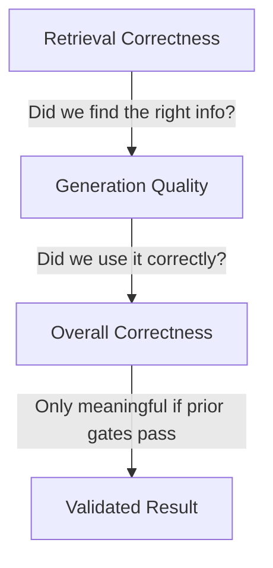

# Why Ground Truth Matters

Principle

Without ground truth, <em>you're grading on vibes.</em>

Unlike traditional ML &mdash; where labeled data fuels both training and validation &mdash; AI agents often operate without predefined answers. Curating a high-quality "golden" test set isn't just important, it's essential. Ground truth turns subjective performance into an objective, repeatable benchmark.

Why It Matters

Approximation <em>is not enough.</em>

Language models can approximate quality, but in high-stakes and domain-specific environments, approximation is not enough. Ground truth anchors evaluation to a consistent standard: the expected answer (and, when applicable, the expected evidence).

---

## What Goes Wrong Without Ground Truth

Even strong evaluation frameworks can fail if they are not anchored to expected outcomes. Three common failure modes:

1

Plausible but wrong

The answer sounds correct, but is outdated, incomplete, or subtly incorrect for the domain.

2

The gullible judge

LLM judges over-reward "safe" answers or fluent answers, scoring linguistic plausibility rather than correctness.

3

The helpful liar

Retrieval returns noisy context. The model synthesizes a convincing answer from noise. Similarity-based evals still pass it.

---

## The Core Reasons Ground Truth Matters

&#x2713;

Factual Accuracy

Reveals whether an answer is actually correct &mdash; not merely plausible or well-written.

&#x2713;

Relevance & Completeness

Clarifies what must be covered and what is irrelevant, preventing "good-sounding" partial responses from passing.

&#x2713;

Retrieval Correctness

Enables objective checks that the system found and cited the right documents &mdash; separating retrieval failure from generation failure.

&#x2713;

Determinism

LLM judging is inherently variable. Ground truth reduces subjectivity and makes scoring repeatable across runs, models, and prompt iterations.

&#x2713;

Benchmarking & Iteration

A fixed test set lets you run fair A/B tests, track regressions, and measure improvements with confidence.

---

## Ground Truth Dataset Lifecycle

1

Formation

Curate high-value, real-world utterances. Validate expected outcomes with domain experts.

2

Maintenance

Establish review cycles and governance to keep answers current as products, policies, and knowledge evolve.

3

Expansion

Grow coverage intentionally &mdash; edge cases, failure clusters, controlled synthetic generation &mdash; without compromising quality.

---

## A Practical Evaluation Approach

For reliable evaluation, structure matters:

- **Decompose the workflow** into discrete steps (e.g., routing, retrieval, tool-use, generation).
- **Build test cases per step**, not just end-to-end: you want to isolate where failures occur.
- **Use hierarchical gates**:

---

## Inconsistent Scoring

!!! warning "Why LLM-Only Evaluation Fails"
    LLMs are non-deterministic, and LLM judges can disagree—even on the same answer. Without ground truth, evaluations drift toward subjective heuristics like fluency, verbosity, or "sounds right."

Ground truth is the only way to anchor evaluation to objective, expected outcomes. Without it, you're measuring style. With it, you're measuring substance.

[Evaluation Flywheel :octicons-arrow-right-24:](evaluation_flywheel.md){ .md-button .md-button--primary }
[Agent Evaluation Playbook :octicons-arrow-right-24:](agent_playbook.md){ .md-button }
